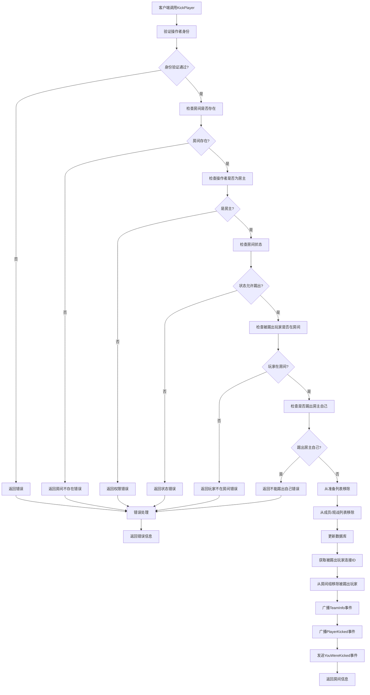

# 踢出玩家接口

## 接口信息

- **接口名称**: `KickPlayer`
- **描述**: 房主将指定玩家踢出房间
- **调用方式**: SignalR Hub方法调用

## 参数说明

| 参数名 | 类型 | 必填 | 说明 |
|--------|------|------|------|
| roomID | string | 是 | 房间ID |
| targetPlayerUID | string | 是 | 被踢出玩家的UID |
| operatorUID | string | 是 | 操作者UID（必须是房主） |

### 参数示例

```json
{
    "roomID": "072504001",
    "targetPlayerUID": "08233-87956-48746-16119-67337",
    "operatorUID": "12345-67890-12345-67890-12345"
}
```

## 调用示例

### 前端调用（JavaScript）

```javascript
// 踢出玩家
connection.invoke("KickPlayer", "072504001", "08233-87956-48746-16119-67337", "12345-67890-12345-67890-12345")
    .then(result => {
        console.log("踢出玩家成功:", result);
    })
    .catch(err => {
        console.error("踢出玩家失败:", err);
    });
```

### 后端实现（C#）

```csharp
public class PlayerHubService : Hub
{
    public async Task<Room> KickPlayer(string roomID, string targetPlayerUID, string operatorUID)
    {
        try
        {
            // 验证操作者身份
            if (!ValidateUser(operatorUID))
            {
                throw new HubException("操作者身份验证失败");
            }

            // 检查房间是否存在
            var room = await GetRoomFromDatabase(roomID);
            if (room == null)
            {
                throw new HubException("房间不存在");
            }

            // 检查操作者是否为房主
            if (room.Owner != operatorUID)
            {
                throw new HubException("只有房主可以踢出玩家");
            }

            // 检查房间状态
            if (room.status != "等待中")
            {
                throw new HubException("房间状态不允许踢出玩家");
            }

            // 检查被踢出玩家是否在房间中
            bool isInMember = room.Member.Contains(targetPlayerUID);
            bool isInWatch = room.Watch.Contains(targetPlayerUID);
            
            if (!isInMember && !isInWatch)
            {
                throw new HubException("被踢出的玩家不在房间中");
            }

            // 检查是否踢出房主自己
            if (targetPlayerUID == operatorUID)
            {
                throw new HubException("房主不能踢出自己");
            }

            // 从准备列表中移除
            if (room.Ready.Contains(targetPlayerUID))
            {
                room.Ready.Remove(targetPlayerUID);
            }

            // 从成员列表中移除
            if (isInMember)
            {
                room.Member.Remove(targetPlayerUID);
            }

            // 从观战列表中移除
            if (isInWatch)
            {
                room.Watch.Remove(targetPlayerUID);
            }

            // 更新数据库
            await UpdateRoomInDatabase(room);

            // 获取被踢出玩家的连接ID
            var targetConnectionId = await GetPlayerConnectionId(targetPlayerUID);

            // 从房间组中移除被踢出的玩家
            if (!string.IsNullOrEmpty(targetConnectionId))
            {
                await Groups.RemoveFromGroupAsync(targetConnectionId, roomID);
            }

            // 广播房间信息更新给剩余玩家
            await Clients.Group(roomID).SendAsync("TeamInfo", room);

            // 广播踢出事件给剩余玩家
            await Clients.Group(roomID).SendAsync("PlayerKicked", new
            {
                roomID = roomID,
                targetPlayerUID = targetPlayerUID,
                targetPlayerName = GetPlayerName(targetPlayerUID),
                operatorUID = operatorUID,
                operatorName = GetPlayerName(operatorUID),
                reason = "被房主踢出"
            });

            // 向被踢出的玩家发送踢出通知
            if (!string.IsNullOrEmpty(targetConnectionId))
            {
                await Clients.Client(targetConnectionId).SendAsync("YouWereKicked", new
                {
                    roomID = roomID,
                    roomName = room.Name,
                    operatorUID = operatorUID,
                    operatorName = GetPlayerName(operatorUID),
                    reason = "被房主踢出"
                });
            }

            return room;
        }
        catch (Exception ex)
        {
            throw new HubException($"踢出玩家失败: {ex.Message}");
        }
    }
}
```

## 返回事件

### PlayerKicked 事件

当有玩家被踢出时，服务器会向房间内剩余玩家广播 `PlayerKicked` 事件。

#### 事件名称
`PlayerKicked`

#### 事件数据
```json
{
    "roomID": "072504001",
    "targetPlayerUID": "08233-87956-48746-16119-67337",
    "targetPlayerName": "被踢出的玩家",
    "operatorUID": "12345-67890-12345-67890-12345",
    "operatorName": "房主",
    "reason": "被房主踢出"
}
```

### YouWereKicked 事件

当玩家被踢出时，服务器会向被踢出的玩家发送 `YouWereKicked` 事件。

#### 事件名称
`YouWereKicked`

#### 事件数据
```json
{
    "roomID": "072504001",
    "roomName": "测试房间",
    "operatorUID": "12345-67890-12345-67890-12345",
    "operatorName": "房主",
    "reason": "被房主踢出"
}
```

### 前端监听示例

```javascript
// 监听房间信息更新
connection.on("TeamInfo", (roomData) => {
    console.log("房间信息更新:", roomData);
    updateRoomUI(roomData);
});

// 监听玩家被踢出事件（房主和其他玩家）
connection.on("PlayerKicked", (data) => {
    console.log(`${data.targetPlayerName} 被 ${data.operatorName} 踢出了房间`);
    showNotification(`${data.targetPlayerName} 被踢出了房间`);
    updatePlayerListUI(data);
});

// 监听自己被踢出事件
connection.on("YouWereKicked", (data) => {
    console.log(`你被 ${data.operatorName} 从房间 ${data.roomName} 中踢出`);
    showNotification(`你被踢出了房间: ${data.roomName}`);
    // 跳转到房间列表页面
    navigateToRoomList();
});
```

## 执行流程图



## 错误处理

### 常见错误码

| 错误码 | 错误信息 | 处理方式 |
|--------|----------|----------|
| 1001 | 参数错误 | 检查参数是否为空或格式错误 |
| 1002 | 房间不存在 | 检查房间ID是否正确 |
| 1004 | 权限不足 | 只有房主可以踢出玩家 |
| 1006 | 玩家不在房间中 | 检查被踢出玩家是否真的在房间中 |
| 1008 | 房间状态不允许操作 | 只有"等待中"状态允许踢出 |
| 1013 | 不能踢出房主自己 | 房主不能踢出自己 |
| 1009 | 网络连接异常 | 检查网络连接状态 |
| 1010 | 服务器内部错误 | 联系技术支持 |

### 错误响应示例

```json
{
    "error": {
        "code": 1004,
        "message": "权限不足",
        "details": "只有房主可以踢出玩家"
    }
}
```

## 特殊情况处理

### 1. 房主权限

只有房主可以踢出玩家：

- 普通玩家无法踢出其他玩家
- 房主不能踢出自己
- 房主可以踢出任何其他玩家

### 2. 房间状态限制

只有在"等待中"状态的房间才能踢出玩家：

- "准备中"和"游戏中"状态不允许踢出
- 确保游戏进行中的稳定性

### 3. 被踢出玩家处理

被踢出的玩家会：

- 立即从房间中移除
- 收到踢出通知
- 自动跳转到房间列表页面

### 4. 连接管理

被踢出的玩家：

- 从房间组中移除
- 断开与房间的实时连接
- 清除本地房间状态

## 注意事项

### 1. 权限控制
- 严格限制只有房主可以踢出玩家
- 防止恶意踢出行为
- 记录踢出操作日志

### 2. 用户体验
- 被踢出玩家收到明确通知
- 其他玩家看到踢出提示
- 提供重新加入的选项

### 3. 数据一致性
- 踢出操作立即生效
- 确保所有玩家状态同步
- 处理网络异常情况

### 4. 安全性
- 验证操作者身份
- 防止重复踢出
- 记录操作历史

### 5. 性能考虑
- 使用异步操作
- 批量处理状态更新
- 避免不必要的数据库查询

## 测试用例

### 正常情况测试

```javascript
// 测试用例1：房主踢出普通玩家
connection.invoke("KickPlayer", "072504001", "12345-67890-12345-67890-12345", "08233-87956-48746-16119-67337")
    .then(room => {
        assert(!room.Member.includes("12345-67890-12345-67890-12345"));
        assert(!room.Watch.includes("12345-67890-12345-67890-12345"));
        console.log("测试通过：房主成功踢出玩家");
    });

// 测试用例2：房主踢出观战玩家
connection.invoke("KickPlayer", "072504001", "98765-43210-98765-43210-98765", "08233-87956-48746-16119-67337")
    .then(room => {
        assert(!room.Watch.includes("98765-43210-98765-43210-98765"));
        console.log("测试通过：房主成功踢出观战玩家");
    });
```

### 异常情况测试

```javascript
// 测试用例3：普通玩家尝试踢出其他玩家
connection.invoke("KickPlayer", "072504001", "12345-67890-12345-67890-12345", "99999-99999-99999-99999-99999")
    .then(() => {
        console.error("测试失败：应该抛出错误");
    })
    .catch(error => {
        assert(error.message.includes("只有房主可以踢出玩家"));
        console.log("测试通过：权限不足被正确处理");
    });

// 测试用例4：房主尝试踢出自己
connection.invoke("KickPlayer", "072504001", "08233-87956-48746-16119-67337", "08233-87956-48746-16119-67337")
    .then(() => {
        console.error("测试失败：应该抛出错误");
    })
    .catch(error => {
        assert(error.message.includes("房主不能踢出自己"));
        console.log("测试通过：不能踢出自己被正确处理");
    });
```

## 相关接口

- [加入房间](./join-room.mdx)
- [离开房间](./leave-room.mdx)
- [转让房主权限](./transfer-ownership.mdx)
- [房间信息更新](./room-events.mdx)
- [玩家状态变化](./player-events.mdx) 