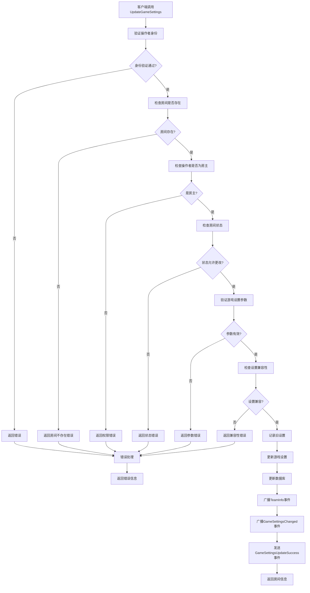

# 更改游戏设置接口

## 接口信息

- **接口名称**: `UpdateGameSettings`
- **描述**: 房主更改游戏的设置参数（地图、游戏模式等）
- **调用方式**: SignalR Hub方法调用

## 参数说明

| 参数名 | 类型 | 必填 | 说明 |
|--------|------|------|------|
| roomID | string | 是 | 房间ID |
| gameSettings | object | 是 | 新的游戏设置对象 |
| operatorUID | string | 是 | 操作者UID（必须是房主） |

### gameSettings对象字段

| 字段名 | 类型 | 必填 | 可选值 | 说明 |
|--------|------|------|--------|------|
| Map | string | 否 | de_dust2、de_mirage、de_inferno、de_nuke、de_train、de_overpass、de_vertigo | 游戏地图 |
| Mode | string | 否 | 竞技模式、爆头竞技模式、死亡竞赛模式、爆头死亡竞赛模式 | 游戏模式 |

### 参数示例

```json
{
    "roomID": "072504001",
    "gameSettings": {
        "Map": "de_mirage",
        "Mode": "爆头竞技模式"
    },
    "operatorUID": "08233-87956-48746-16119-67337"
}
```

## 调用示例

### 前端调用（JavaScript）

```javascript
// 更改游戏设置
const newGameSettings = {
    Map: "de_mirage",
    Mode: "爆头竞技模式"
};

connection.invoke("UpdateGameSettings", "072504001", newGameSettings, "08233-87956-48746-16119-67337")
    .then(result => {
        console.log("更改游戏设置成功:", result);
    })
    .catch(err => {
        console.error("更改游戏设置失败:", err);
    });
```

### 后端实现（C#）

```csharp
public class PlayerHubService : Hub
{
    public async Task<Room> UpdateGameSettings(string roomID, GameSettings newGameSettings, string operatorUID)
    {
        try
        {
            // 验证操作者身份
            if (!ValidateUser(operatorUID))
            {
                throw new HubException("操作者身份验证失败");
            }

            // 检查房间是否存在
            var room = await GetRoomFromDatabase(roomID);
            if (room == null)
            {
                throw new HubException("房间不存在");
            }

            // 检查操作者是否为房主
            if (room.Owner != operatorUID)
            {
                throw new HubException("只有房主可以更改游戏设置");
            }

            // 检查房间状态
            if (room.status != "等待中")
            {
                throw new HubException("房间状态不允许更改游戏设置");
            }

            // 验证游戏设置参数
            ValidateGameSettings(newGameSettings);

            // 检查设置变更的兼容性
            await ValidateGameSettingsCompatibility(room, newGameSettings);

            // 记录修改前的设置
            var oldGameSettings = room.Game.Clone();

            // 更新游戏设置
            if (!string.IsNullOrEmpty(newGameSettings.Map))
            {
                room.Game.Map = newGameSettings.Map;
            }
            if (!string.IsNullOrEmpty(newGameSettings.Mode))
            {
                room.Game.Mode = newGameSettings.Mode;
            }

            // 更新数据库
            await UpdateRoomInDatabase(room);

            // 广播房间信息更新
            await Clients.Group(roomID).SendAsync("TeamInfo", room);

            // 广播游戏设置更改事件
            await Clients.Group(roomID).SendAsync("GameSettingsChanged", new
            {
                roomID = roomID,
                operatorUID = operatorUID,
                operatorName = GetPlayerName(operatorUID),
                oldGameSettings = oldGameSettings,
                newGameSettings = room.Game,
                changeTime = DateTime.Now.ToString("yyyy-MM-dd HH:mm:ss")
            });

            // 向房主发送确认通知
            var ownerConnectionId = await GetPlayerConnectionId(operatorUID);
            if (!string.IsNullOrEmpty(ownerConnectionId))
            {
                await Clients.Client(ownerConnectionId).SendAsync("GameSettingsUpdateSuccess", new
                {
                    roomID = roomID,
                    newGameSettings = room.Game,
                    changeTime = DateTime.Now.ToString("yyyy-MM-dd HH:mm:ss")
                });
            }

            return room;
        }
        catch (Exception ex)
        {
            throw new HubException($"更改游戏设置失败: {ex.Message}");
        }
    }

    private void ValidateGameSettings(GameSettings settings)
    {
        // 验证地图
        if (!string.IsNullOrEmpty(settings.Map))
        {
            var validMaps = new[] { 
                "de_dust2", "de_mirage", "de_inferno", "de_nuke", 
                "de_train", "de_overpass", "de_vertigo" 
            };
            if (!validMaps.Contains(settings.Map))
            {
                throw new HubException("无效的游戏地图");
            }
        }

        // 验证游戏模式
        if (!string.IsNullOrEmpty(settings.Mode))
        {
            var validModes = new[] { 
                "竞技模式", "爆头竞技模式", "死亡竞赛模式", "爆头死亡竞赛模式" 
            };
            if (!validModes.Contains(settings.Mode))
            {
                throw new HubException("无效的游戏模式");
            }
        }
    }

    private async Task ValidateGameSettingsCompatibility(Room room, GameSettings newGameSettings)
    {
        // 检查地图和模式的兼容性
        if (!string.IsNullOrEmpty(newGameSettings.Map) && !string.IsNullOrEmpty(newGameSettings.Mode))
        {
            if (!IsMapModeCompatible(newGameSettings.Map, newGameSettings.Mode))
            {
                throw new HubException($"地图 {newGameSettings.Map} 与模式 {newGameSettings.Mode} 不兼容");
            }
        }

        // 检查玩家数量与模式的兼容性
        if (!string.IsNullOrEmpty(newGameSettings.Mode))
        {
            var minPlayers = GetMinPlayersForMode(newGameSettings.Mode);
            if (room.Member.Count < minPlayers)
            {
                throw new HubException($"当前玩家数量不足以支持 {newGameSettings.Mode}");
            }
        }
    }

    private bool IsMapModeCompatible(string map, string mode)
    {
        // 这里可以根据实际需求定义地图和模式的兼容性规则
        // 示例：所有地图都支持所有模式
        return true;
    }

    private int GetMinPlayersForMode(string mode)
    {
        return mode switch
        {
            "竞技模式" => 2,
            "爆头竞技模式" => 2,
            "死亡竞赛模式" => 1,
            "爆头死亡竞赛模式" => 1,
            _ => 1
        };
    }
}

// GameSettings类的扩展方法
public static class GameSettingsExtensions
{
    public static GameSettings Clone(this GameSettings settings)
    {
        return new GameSettings
        {
            ID = settings.ID,
            Map = settings.Map,
            Mode = settings.Mode
        };
    }
}
```

## 返回事件

### TeamInfo 事件

当游戏设置更改成功后，服务器会向房间内所有玩家广播 `TeamInfo` 事件。

#### 事件名称
`TeamInfo`

#### 事件数据
```json
{
    "ID": "072504001",
    "Name": "测试房间",
    "Type": "1",
    "MaxPlayer": 10,
    "Password": "",
    "Owner": "08233-87956-48746-16119-67337",
    "Member": [
        "08233-87956-48746-16119-67337",
        "12345-67890-12345-67890-12345"
    ],
    "Watch": [],
    "Ready": [],
    "Game": {
        "ID": "CutomMatch - 072504001",
        "Map": "de_mirage",
        "Mode": "爆头竞技模式"
    },
    "Room_Setting": {
        "Region": "北京",
        "Mode": "5v5",
        "Player_Choose": true,
        "Team_Balance": false
    },
    "status": "等待中",
    "CreateTime": "2025-07-04 10:00:00"
}
```

### GameSettingsChanged 事件

当游戏设置发生变化时，服务器会广播 `GameSettingsChanged` 事件。

#### 事件名称
`GameSettingsChanged`

#### 事件数据
```json
{
    "roomID": "072504001",
    "operatorUID": "08233-87956-48746-16119-67337",
    "operatorName": "房主",
    "oldGameSettings": {
        "ID": "CutomMatch - 072504001",
        "Map": "de_dust2",
        "Mode": "竞技模式"
    },
    "newGameSettings": {
        "ID": "CutomMatch - 072504001",
        "Map": "de_mirage",
        "Mode": "爆头竞技模式"
    },
    "changeTime": "2025-07-04 10:30:00"
}
```

### GameSettingsUpdateSuccess 事件

当房主成功更改游戏设置时，服务器会向房主发送 `GameSettingsUpdateSuccess` 事件。

#### 事件名称
`GameSettingsUpdateSuccess`

#### 事件数据
```json
{
    "roomID": "072504001",
    "newGameSettings": {
        "ID": "CutomMatch - 072504001",
        "Map": "de_mirage",
        "Mode": "爆头竞技模式"
    },
    "changeTime": "2025-07-04 10:30:00"
}
```

### 前端监听示例

```javascript
// 监听房间信息更新
connection.on("TeamInfo", (roomData) => {
    console.log("房间信息更新:", roomData);
    updateRoomUI(roomData);
});

// 监听游戏设置变化事件
connection.on("GameSettingsChanged", (data) => {
    console.log(`${data.operatorName} 更改了游戏设置`);
    showNotification(`${data.operatorName} 更改了游戏设置`);
    
    // 显示游戏设置变更详情
    showGameSettingsChangeDetails(data.oldGameSettings, data.newGameSettings);
    updateGameSettingsUI(data.newGameSettings);
});

// 监听游戏设置更新成功事件（房主）
connection.on("GameSettingsUpdateSuccess", (data) => {
    console.log("游戏设置更新成功");
    showNotification("游戏设置更新成功");
    updateGameSettingsUI(data.newGameSettings);
});
```

## 执行流程图



## 错误处理

### 常见错误码

| 错误码 | 错误信息 | 处理方式 |
|--------|----------|----------|
| 1001 | 参数错误 | 检查参数是否为空或格式错误 |
| 1002 | 房间不存在 | 检查房间ID是否正确 |
| 1004 | 权限不足 | 只有房主可以更改游戏设置 |
| 1008 | 房间状态不允许操作 | 只有"等待中"状态允许更改 |
| 1019 | 无效的游戏地图 | 检查Map参数是否在有效范围内 |
| 1020 | 无效的游戏模式 | 检查Mode参数是否在有效范围内 |
| 1021 | 地图模式不兼容 | 检查地图和模式是否兼容 |
| 1022 | 玩家数量不足 | 检查当前玩家数量是否满足模式要求 |
| 1009 | 网络连接异常 | 检查网络连接状态 |
| 1010 | 服务器内部错误 | 联系技术支持 |

### 错误响应示例

```json
{
    "error": {
        "code": 1021,
        "message": "地图模式不兼容",
        "details": "地图 de_dust2 与模式 爆头竞技模式 不兼容"
    }
}
```

## 特殊情况处理

### 1. 地图模式兼容性

当更改地图或模式时：

- 检查地图和模式的兼容性
- 某些地图可能不支持特定模式
- 提供兼容性建议

### 2. 玩家数量要求

不同游戏模式有不同的玩家数量要求：

- 竞技模式：最少2人
- 死亡竞赛模式：最少1人
- 检查当前玩家数量是否满足要求

### 3. 游戏状态影响

游戏设置变更会影响：

- 游戏服务器的选择
- 游戏规则的执行
- 玩家的游戏体验

### 4. 设置继承

游戏设置会影响：

- 后续游戏的默认设置
- 新加入玩家的游戏体验
- 房间的游戏风格

## 注意事项

### 1. 权限控制
- 严格限制只有房主可以更改游戏设置
- 防止恶意设置变更
- 记录设置变更历史

### 2. 兼容性检查
- 验证游戏设置的合理性
- 检查与当前房间状态的兼容性
- 提供详细的错误提示

### 3. 用户体验
- 提供游戏设置变更的实时反馈
- 显示变更前后的对比
- 支持设置回滚功能

### 4. 数据一致性
- 游戏设置变更立即生效
- 确保所有玩家状态同步
- 处理网络异常情况

### 5. 性能考虑
- 使用异步操作处理设置更新
- 避免不必要的数据库查询
- 优化设置验证逻辑

## 测试用例

### 正常情况测试

```javascript
// 测试用例1：更改游戏地图
const mapSettings = { Map: "de_mirage" };
connection.invoke("UpdateGameSettings", "072504001", mapSettings, "08233-87956-48746-16119-67337")
    .then(room => {
        assert(room.Game.Map === "de_mirage");
        console.log("测试通过：游戏地图更改成功");
    });

// 测试用例2：更改游戏模式
const modeSettings = { Mode: "爆头竞技模式" };
connection.invoke("UpdateGameSettings", "072504001", modeSettings, "08233-87956-48746-16119-67337")
    .then(room => {
        assert(room.Game.Mode === "爆头竞技模式");
        console.log("测试通过：游戏模式更改成功");
    });
```

### 异常情况测试

```javascript
// 测试用例3：普通玩家尝试更改游戏设置
const testSettings = { Map: "de_mirage" };
connection.invoke("UpdateGameSettings", "072504001", testSettings, "99999-99999-99999-99999-99999")
    .then(() => {
        console.error("测试失败：应该抛出错误");
    })
    .catch(error => {
        assert(error.message.includes("只有房主可以更改游戏设置"));
        console.log("测试通过：权限不足被正确处理");
    });

// 测试用例4：无效的游戏地图
const invalidMapSettings = { Map: "invalid_map" };
connection.invoke("UpdateGameSettings", "072504001", invalidMapSettings, "08233-87956-48746-16119-67337")
    .then(() => {
        console.error("测试失败：应该抛出错误");
    })
    .catch(error => {
        assert(error.message.includes("无效的游戏地图"));
        console.log("测试通过：无效地图被正确处理");
    });
```

## 相关接口

- [加入房间](./join-room.mdx)
- [离开房间](./leave-room.mdx)
- [更改房间设置](./update-room-settings.mdx)
- [房间信息更新](./room-events.mdx) 