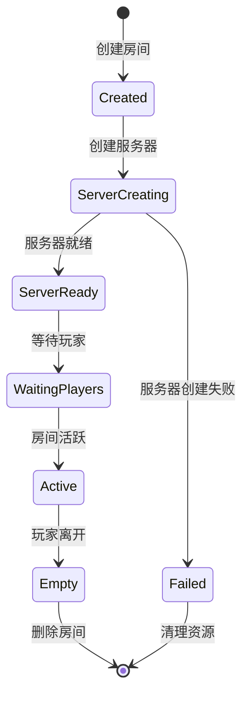

# CustomRoom 模型技术文档

## 概述

CustomRoom 模型是 Elo 匹配系统中自定义房间管理的核心实体，负责管理用户创建的自定义游戏房间的完整生命周期。该模型集成了服务器自动生成、游戏参数同步、聊天系统、玩家管理等功能，为用户提供了完整的自定义游戏体验。

## 核心类结构

### CustomRoom 主类

```csharp
public class CustomRoom
{
    private readonly IHubContext<LeisureCenterService> _hubContext;
    private Timer _checkPlayerCountTimer;
    private int _zeroPlayerCountAttempts = 0; // 记录连续检查到的0人次数

    public string? RoomID { get; set; } // 房间ID
    public Player Owner { get; set; } // 队伍的管理者
    public List <Player > TeamMembers { get; set; } // 队伍成员列表
    public int RoomPlayerCount { get; set; } = 0; // 房间内的玩家数量，默认 0 人
    public CustomRoomBaseInfo BaseInfo { get; set; } = new CustomRoomBaseInfo();
    public CustomRoomGameInfo GameInfo { get; set; } = new CustomRoomGameInfo();
    public CustomRoomServer Server { get; set; } = new CustomRoomServer();
    public List< IMessage > RoomMessageList { get; set; } // 房间聊天列表
}
```

### 核心属性说明

| 属性 | 类型 | 说明 | 默认值 |
|------|------|------|--------|
| RoomID | string? | 房间唯一标识符 | null |
| Owner | Player | 房间创建者和管理者 | - |
| TeamMembers | List< Player > | 房间成员列表 | - |
| RoomPlayerCount | int | 房间内玩家数量 | 0 |
| BaseInfo | CustomRoomBaseInfo | 房间基本信息 | new() |
| GameInfo | CustomRoomGameInfo | 游戏配置信息 | new() |
| Server | CustomRoomServer | 服务器信息 | new() |
| RoomMessageList | List< IMessage > | 房间聊天消息列表 | - |

## 子模型详解

### CustomRoomBaseInfo - 房间基本信息

```csharp
public class CustomRoomBaseInfo
{
    public string? RoomName { get; set; } // 房间名称
    public string? RoomImage { get; set; } = "https://static.wikia.nocookie.net/cswikia/images/f/f5/De_mirage_cs2.png";
    public bool? TeamOpenStatus { get; set; } = true;  // 房间是否外可见
    public bool? RoomInvite { get; set; } = false;
    public string? Password { get; set; } = ""; // 房间是否需要密码加入
    public int MaxPlayerSize { get; set; } = 20;  // 队伍人数，默认20人，最大支持64人
}
```

**属性说明**:

| 属性 | 类型 | 说明 | 默认值 |
|------|------|------|--------|
| RoomName | string? | 房间名称 | null |
| RoomImage | string? | 房间图片URL | 默认地图图片 |
| TeamOpenStatus | bool? | 房间是否公开可见 | true |
| RoomInvite | bool? | 是否允许邀请 | false |
| Password | string? | 房间密码 | "" |
| MaxPlayerSize | int | 最大玩家数量 | 20 |

### CustomRoomGameInfo - 游戏配置信息

```csharp
public class CustomRoomGameInfo 
{
    public string? GameMode { get; set; } = "竞技模式"; // 游戏模式
    public string? GameMap { get; set; } = "de_mirage"; // 游戏地图组
    public string? GameMapGroup { get; set; } = ""; // 地图订阅编码
    public bool? GameStatus { get; set; } = false; // false 等待中 , true 游戏中
}
```

**属性说明**:

| 属性 | 类型 | 说明 | 默认值 |
|------|------|------|--------|
| GameMode | string? | 游戏模式 | "竞技模式" |
| GameMap | string? | 游戏地图 | "de_mirage" |
| GameMapGroup | string? | 地图订阅编码 | "" |
| GameStatus | bool? | 游戏状态 | false |

### CustomRoomServer - 服务器信息

```csharp
public class CustomRoomServer 
{
    public bool? ServerIsCreate { get; set; } = false; // 默认服务器未处于创建中
    public string? Status { get; set; } = "NOTLINE";
    public string? ServerMode { get; set; } = "";
    public string PlayerCount { get; set; } = "0";
    public string GameType { get; set; } = "0";
    public string GameMode { get; set; } = "1";
    public string? GameMap { get; set; } = "de_mirage";
    public string? ServerID { get; set; } // 服务器ID信息
    public string? ServerName { get; set; } // 服务器名称
    public string? ServerRegion { get; set; } // 服务器地区信息
    public string? ServerIP { get; set; } // 服务器IP地址信息
    public string? Port { get; set; } // 服务器端口信息
    public string? CreateTime { get; set; } // 服务器创建时间
}
```

**属性说明**:

| 属性 | 类型 | 说明 | 默认值 |
|------|------|------|--------|
| ServerIsCreate | bool? | 服务器是否正在创建 | false |
| Status | string? | 服务器状态 | "NOTLINE" |
| ServerMode | string? | 服务器模式 | "" |
| PlayerCount | string | 当前玩家数量 | "0" |
| GameType | string | 游戏类型 | "0" |
| GameMode | string | 游戏模式 | "1" |
| GameMap | string? | 游戏地图 | "de_mirage" |
| ServerID | string? | 服务器ID | null |
| ServerName | string? | 服务器名称 | null |
| ServerRegion | string? | 服务器地区 | null |
| ServerIP | string? | 服务器IP地址 | null |
| Port | string? | 服务器端口 | null |
| CreateTime | string? | 创建时间 | null |

### 消息系统模型

#### IMessage - 消息接口

```csharp
public interface IMessage
{
    DateTime Time { get; set; }
}
```

#### Message - 玩家消息

```csharp
public class Message : IMessage
{
    public Player Sender { get; set; }
    public DateTime Time { get; set; }
    public string Content { get; set; }
    public CustomRoom? Room { get; set; }
}
```

#### SystemMessage - 系统消息

```csharp
public class SystemMessage : IMessage
{
    public string Type { get; set; }
    public string Message { get; set; }
    public DateTime Time { get; set; }
}
```

## 核心方法

### CustomRoomInitialization() - 房间初始化

```csharp
public void CustomRoomInitialization()
{
    BaseInfo.RoomName = Owner.PInfo.FullName + "的房间";
    TeamMembers = new List< Player >() { };
    RoomMessageList = new List< IMessage >() { };
    // 同步房间人数
    AsyncRoomPlayerCount();
}
```

**初始化逻辑**:
1. 设置房间名称为创建者姓名 + "的房间"
2. 初始化成员列表
3. 初始化消息列表
4. 同步房间人数

### AsyncRoomPlayerCount() - 同步房间人数

```csharp
public void AsyncRoomPlayerCount()
{
    RoomPlayerCount = 1; // Owner 本身算一个人
    if (TeamMembers != null)
    {
        RoomPlayerCount += TeamMembers.Count;
    }
}
```

**计算逻辑**:
- 房间创建者（Owner）计为1人
- 房间成员数量累加
- 总人数 = 1 + 成员数量

### AsyncGameService() - 同步游戏参数

```csharp
public async Task AsyncGameService(bool Forced = false)
{
    // 同步游戏模式
    await AsyncGameMode(Forced);

    Thread.Sleep(1500);

    // 同步地图
    if (Server.GameMap != GameInfo.GameMap || Forced)
    {
        string Command;
        // 检查 GameInfo.GameMap 是否是纯数字
        here:
        Console.WriteLine($"正在切换服务器地图：{GameInfo.GameMap}");
        if (!string.IsNullOrEmpty(GameInfo.GameMap) && GameInfo.GameMap.All(char.IsDigit))
        {
            Command = $"host_workshop_map {GameInfo.GameMap}";
            Console.WriteLine($"执行切换服务器地图命令：{Command}");
        }
        else
        {
            Command = $"map {GameInfo.GameMap}";
            Console.WriteLine($"执行切换服务器地图命令：{Command}");
        }
        await ActionGameServiceCommand(Command);
        Server.GameMap = GameInfo.GameMap;
    }
}
```

**同步逻辑**:
1. 同步游戏模式
2. 等待1.5秒
3. 检查地图是否需要更新
4. 执行地图切换命令

### AsyncGameMode() - 同步游戏模式

```csharp
public async Task<bool> AsyncGameMode(bool Forced=false)
{
    bool IsRestartGame = false;

    if (Server.ServerMode != GameInfo.GameMode)
    {
        string Command = "";
        // 修改游戏服务的模式
        string Game_Mode = "0";
        string Game_Type = "0";

        switch (GameInfo.GameMode)
        {
            case "休闲竞技":
                Game_Mode = "0";
                Game_Type = "0";
                break;
            case "竞技模式":
                Game_Mode = "1";
                Game_Type = "0";
                break;
            case "搭档模式":
                Game_Mode = "2";
                Game_Type = "0";
                break;
            case "军备竞赛":
                Game_Mode = "0";
                Game_Type = "1";
                break;
            case "死亡竞赛":
                Game_Mode = "2";
                Game_Type = "1";
                break;
            case "单挑对战":
                Game_Mode = "1";
                Game_Type = "0";
                break;
            case "训练模式":
                Game_Mode = "1";
                Game_Type = "0";
                break;
            default:
                // 处理未知模式的情况，如果有需要可以抛出异常或记录日志
                break;
        }

        if (Server.GameType != Game_Type || Forced) // 切换游戏类型
        {
            Command = $"game_type {Game_Type}";
            await ActionGameServiceCommand(Command);
            Console.WriteLine($"执行切换类型：{Command}");
            Server.GameType = Game_Type;
            IsRestartGame = true;
        }

        if (Server.GameMode != Game_Mode || Forced) { // 切换游戏模式模式
            Command = $"game_mode {Game_Mode}";
            await ActionGameServiceCommand(Command);
            Console.WriteLine($"执行切换模式：{Command}");
            Server.GameMode = Game_Mode;
            if (IsRestartGame)
            {
                await ActionGameServiceCommand("mp_restartgame 1"); // 1 秒后刷新游戏
            }
        }
        Console.WriteLine($"切换服务器模式：{GameInfo.GameMode}");
        Server.ServerMode = GameInfo.GameMode;
        return true;
    }
    else
    {
        return false;
    }
}
```

**模式同步逻辑**:
1. 检查服务器模式是否需要更新
2. 根据游戏模式设置对应的服务器参数
3. 先切换游戏类型，再切换游戏模式
4. 如果需要重启游戏，执行重启命令

### AddPlayerMessage() - 添加玩家消息

```csharp
public Message AddPlayerMessage(string ConnectID, string message)
{
    Player player = null;
    try
    {
        // 查找玩家
        if (Owner.ConnectID == ConnectID)
        {
            player = Owner;
        }
        else
        {
            player = TeamMembers.FirstOrDefault(m => m.ConnectID == ConnectID);
        }

        if (player == null)
        {
            throw new InvalidOperationException($"未找到连接ID为 {ConnectID} 的玩家");
        }

        var newMessage = new Message
        {
            Sender = player,
            Time = DateTime.UtcNow.AddHours(8),
            Content = message,
            Room = this
        };

        RoomMessageList.Add(newMessage);
        return newMessage;
    }
    catch (Exception ex)
    {
        Console.WriteLine($"添加玩家消息失败: {ex.Message}");
        return null;
    }
}
```

**消息添加逻辑**:
1. 根据连接ID查找发送者
2. 创建新的消息对象
3. 设置消息时间和内容
4. 添加到消息列表

### AddSysteamMessage() - 添加系统消息

```csharp
public SystemMessage AddSysteamMessage(string Type, string Message)
{
    var systemMessage = new SystemMessage
    {
        Type = Type,
        Message = Message,
        Time = DateTime.UtcNow.AddHours(8)
    };

    RoomMessageList.Add(systemMessage);
    return systemMessage;
}
```

### ActionGameServiceCommand() - 执行游戏服务命令

```csharp
public async Task<string> ActionGameServiceCommand(string Command)
{
    try
    {
        if (Server.ServerIP == null || Server.Port == null)
        {
            return "服务器信息不完整";
        }

        var rcon = new RCON(IPAddress.Parse(Server.ServerIP), (ushort)int.Parse(Server.Port), "ace_server_manager_pass");
        await rcon.ConnectAsync();
        
        string response = await rcon.SendCommandAsync(Command);
        Console.WriteLine($"执行命令: {Command}, 响应: {response}");
        
        return response;
    }
    catch (Exception ex)
    {
        Console.WriteLine($"执行游戏服务命令失败: {ex.Message}");
        return $"命令执行失败: {ex.Message}";
    }
}
```

### CreateRoomServer() - 创建房间服务器

```csharp
public async Task<string> CreateRoomServer(int CORE, float RAM, string RegionId)
{
    try
    {
        Server.ServerIsCreate = true;
        Console.WriteLine($"开始创建房间服务器: CORE={CORE}, RAM={RAM}, Region={RegionId}");

        // 申请阿里云ECS实例
        var server = AliYunCloundECS.GenerationImageServer(RegionId);
        if (server == null)
        {
            Server.ServerIsCreate = false;
            return "服务器创建失败";
        }

        // 更新服务器信息
        Server.ServerID = server.ServerID;
        Server.ServerName = server.ServerName;
        Server.ServerIP = server.IP_Address;
        Server.Port = server.Port;
        Server.ServerRegion = server.ServerLocation;
        Server.CreateTime = DateTime.UtcNow.AddHours(8).ToString("yyyy-MM-dd HH:mm:ss");
        Server.Status = server.Status;

        Console.WriteLine($"房间服务器创建成功: {Server.ServerIP}:{Server.Port}");
        Server.ServerIsCreate = false;
        
        return "服务器创建成功";
    }
    catch (Exception ex)
    {
        Server.ServerIsCreate = false;
        Console.WriteLine($"创建房间服务器异常: {ex.Message}");
        return $"服务器创建异常: {ex.Message}";
    }
}
```

**服务器创建流程**:
1. 设置服务器创建状态
2. 申请阿里云ECS实例
3. 更新服务器信息
4. 记录创建时间
5. 返回创建结果

### AsynRoomServerGameInfo() - 同步房间服务器游戏信息

```csharp
public async Task AsynRoomServerGameInfo()
{
    try
    {
        if (Server.ServerIP == null || Server.Port == null)
        {
            return;
        }

        var rcon = new RCON(IPAddress.Parse(Server.ServerIP), (ushort)int.Parse(Server.Port), "ace_server_manager_pass");
        await rcon.ConnectAsync();
        
        // 获取服务器状态信息
        string status = await rcon.SendCommandAsync("status");
        
        // 解析玩家数量
        Server.PlayerCount = ExtractValue(status, @"(\d+)\/\d+");
        
        // 获取游戏模式信息
        string gameMode = await rcon.SendCommandAsync("game_mode");
        Server.GameMode = ExtractValue(gameMode, @"game_mode = (\d+)");
        
        // 获取游戏类型信息
        string gameType = await rcon.SendCommandAsync("game_type");
        Server.GameType = ExtractValue(gameType, @"game_type = (\d+)");
        
        // 获取当前地图
        string currentMap = await rcon.SendCommandAsync("map");
        Server.GameMap = ExtractValue(currentMap, @"map = (.+)");
        
        Console.WriteLine($"同步服务器信息完成: 玩家数={Server.PlayerCount}, 模式={Server.GameMode}, 地图={Server.GameMap}");
    }
    catch (Exception ex)
    {
        Console.WriteLine($"同步房间服务器信息失败: {ex.Message}");
    }
}
```

### DeleteRoomServer() - 删除房间服务器

```csharp
public void DeleteRoomServer()
{
    if (!string.IsNullOrEmpty(Server.ServerID) && !string.IsNullOrEmpty(Server.ServerRegion))
    {
        var region = AliYunCloundECS.Region.FirstOrDefault(r => r.RegionId == Server.ServerRegion);
        if (region != null)
        {
            var client = AliYunCloundECS.CreateClient(region.Endpoint);
            AliYunCloundECS.DeleteInstance(client, region.RegionId, Server.ServerID);
            Console.WriteLine($"删除房间服务器: {Server.ServerID}");
        }
    }
}
```

### CheckPlayerCountAsync() - 检查玩家数量

```csharp
private async Task CheckPlayerCountAsync()
{
    try
    {
        // 同步房间人数
        AsyncRoomPlayerCount();
        
        // 如果房间人数为0
        if (RoomPlayerCount == 0)
        {
            _zeroPlayerCountAttempts++;
            Console.WriteLine($"房间 {RoomID} 连续 {_zeroPlayerCountAttempts} 次检查到0人");
            
            // 如果连续3次检查到0人，删除房间
            if (_zeroPlayerCountAttempts >= 3)
            {
                Console.WriteLine($"房间 {RoomID} 连续3次无人，准备删除");
                await DeleteEmptyRoom();
            }
        }
        else
        {
            // 重置计数器
            _zeroPlayerCountAttempts = 0;
        }
        
        // 广播房间信息
        await BroadcastRoomInfoAsync();
    }
    catch (Exception ex)
    {
        Console.WriteLine($"检查房间玩家数量时发生错误: {ex.Message}");
    }
}
```

**检查逻辑**:
1. 同步房间人数
2. 如果人数为0，增加计数器
3. 连续3次为0时删除房间
4. 广播房间信息更新

### BroadcastRoomInfoAsync() - 广播房间信息

```csharp
private async Task BroadcastRoomInfoAsync()
{
    try
    {
        await _hubContext.Clients.All.SendAsync("RoomInfoUpdated", RoomID, new
        {
            RoomPlayerCount,
            Server.Status,
            Server.PlayerCount,
            GameInfo.GameMode,
            GameInfo.GameMap
        });
    }
    catch (Exception ex)
    {
        Console.WriteLine($"广播房间信息失败: {ex.Message}");
    }
}
```

### ExtractValue() - 提取值

```csharp
private string ExtractValue(string input, string pattern)
{
    var match = Regex.Match(input, pattern);
    return match.Success ? match.Groups[1].Value : "";
}
```

## 房间生命周期管理

### 1. 房间状态流转



### 2. 状态管理逻辑

```csharp
public class RoomStateManager
{
    public enum RoomState
    {
        Created,
        ServerCreating,
        ServerReady,
        WaitingPlayers,
        Active,
        Empty,
        Failed
    }
    
    public static async Task<bool> TransitionToState(CustomRoom room, RoomState newState)
    {
        try
        {
            switch (newState)
            {
                case RoomState.ServerCreating:
                    return await CreateRoomServer(room);
                    
                case RoomState.ServerReady:
                    await room.AsynRoomServerGameInfo();
                    return true;
                    
                case RoomState.Active:
                    await room.AsyncGameService();
                    return true;
                    
                case RoomState.Empty:
                    await HandleEmptyRoom(room);
                    return true;
                    
                default:
                    return true;
            }
        }
        catch (Exception ex)
        {
            Console.WriteLine($"房间状态转换失败: {ex.Message}");
            return false;
        }
    }
}
```

## 成员管理

### 1. 添加成员

```csharp
public bool AddMember(Player player)
{
    // 检查房间是否已满
    if (RoomPlayerCount >= BaseInfo.MaxPlayerSize)
        return false;
    
    // 检查玩家是否已在房间中
    if (Owner.UID == player.UID || 
        TeamMembers.Any(m => m.UID == player.UID))
        return false;
    
    // 检查房间密码
    if (!string.IsNullOrEmpty(BaseInfo.Password))
    {
        // 需要密码验证逻辑
        return false;
    }
    
    // 添加成员
    TeamMembers.Add(player);
    AsyncRoomPlayerCount();
    
    // 添加系统消息
    AddSysteamMessage("PlayerJoined", $"{player.PInfo.Username} 加入了房间");
    
    return true;
}
```

### 2. 移除成员

```csharp
public bool RemoveMember(string playerUID)
{
    var member = TeamMembers.FirstOrDefault(m => m.UID == playerUID);
    if (member == null)
        return false;
    
    TeamMembers.Remove(member);
    AsyncRoomPlayerCount();
    
    // 添加系统消息
    AddSysteamMessage("PlayerLeft", $"{member.PInfo.Username} 离开了房间");
    
    return true;
}
```

### 3. 权限管理

```csharp
public class RoomPermissions
{
    public static bool CanKickMember(Player requester, Player target, CustomRoom room)
    {
        // 只有Owner可以踢人
        return requester.UID == room.Owner.UID;
    }
    
    public static bool CanChangeSettings(Player requester, CustomRoom room)
    {
        // 只有Owner可以修改设置
        return requester.UID == room.Owner.UID;
    }
    
    public static bool CanInvitePlayer(Player requester, CustomRoom room)
    {
        // Owner和成员都可以邀请
        return requester.UID == room.Owner.UID || 
               room.TeamMembers.Any(m => m.UID == requester.UID);
    }
}
```

## 聊天系统

### 1. 消息处理

```csharp
public class ChatManager
{
    public static async Task HandleChatMessage(CustomRoom room, string connectId, string message)
    {
        // 添加玩家消息
        var chatMessage = room.AddPlayerMessage(connectId, message);
        if (chatMessage == null)
            return;
        
        // 广播消息到房间所有成员
        await BroadcastChatMessage(room, chatMessage);
        
        // 检查消息内容（敏感词过滤等）
        await CheckMessageContent(chatMessage);
    }
    
    public static async Task BroadcastChatMessage(CustomRoom room, Message message)
    {
        var messageData = new
        {
            Sender = new
            {
                message.Sender.UID,
                message.Sender.PInfo.Username,
                message.Sender.PInfo.AvatarUrl
            },
            message.Content,
            message.Time
        };
        
        await room._hubContext.Clients.All.SendAsync("ChatMessage", room.RoomID, messageData);
    }
}
```

### 2. 系统消息

```csharp
public static class SystemMessageTypes
{
    public const string PlayerJoined = "PlayerJoined";
    public const string PlayerLeft = "PlayerLeft";
    public const string GameStarted = "GameStarted";
    public const string GameEnded = "GameEnded";
    public const string SettingsChanged = "SettingsChanged";
    public const string ServerStatusChanged = "ServerStatusChanged";
}
```

## 错误处理

### 1. 服务器创建失败处理

```csharp
public static async Task HandleServerCreationFailure(CustomRoom room)
{
    Console.WriteLine($"房间 {room.RoomID} 服务器创建失败");
    
    // 通知房间Owner
    await NotifyRoomOwner(room, "服务器创建失败，请稍后重试");
    
    // 记录失败日志
    await LogRoomFailure(room, "服务器创建失败");
    
    // 清理资源
    await CleanupRoom(room);
}
```

### 2. 玩家异常处理

```csharp
public static async Task HandlePlayerDisconnection(CustomRoom room, Player player)
{
    // 移除玩家
    room.RemoveMember(player.UID);
    
    // 检查房间是否为空
    if (room.RoomPlayerCount == 0)
    {
        await HandleEmptyRoom(room);
    }
    else
    {
        // 通知其他玩家
        await NotifyRoomMembers(room, $"{player.PInfo.Username} 连接异常");
    }
}
```

## 性能优化

### 1. 连接池管理

```csharp
public class RCONConnectionPool
{
    private static readonly ConcurrentDictionary<string, RCON> _connectionPool = new();
    
    public static async Task<RCON> GetConnection(string serverIP, string serverPort)
    {
        var key = $"{serverIP}:{serverPort}";
        
        if (_connectionPool.TryGetValue(key, out var existingConnection))
        {
            try
            {
                // 测试连接是否有效
                await existingConnection.SendCommandAsync("status");
                return existingConnection;
            }
            catch
            {
                _connectionPool.TryRemove(key, out _);
            }
        }
        
        // 创建新连接
        var newConnection = new RCON(IPAddress.Parse(serverIP), (ushort)int.Parse(serverPort), "ace_server_manager_pass");
        await newConnection.ConnectAsync();
        _connectionPool.TryAdd(key, newConnection);
        
        return newConnection;
    }
}
```

### 2. 消息缓存

```csharp
public class MessageCache
{
    private const int MaxMessageCount = 100;
    
    public static void AddMessage(CustomRoom room, IMessage message)
    {
        room.RoomMessageList.Add(message);
        
        // 如果消息数量超过限制，移除最旧的消息
        if (room.RoomMessageList.Count > MaxMessageCount)
        {
            room.RoomMessageList.RemoveAt(0);
        }
    }
}
```

## 监控和维护

### 1. 房间健康检查

```csharp
public static class RoomHealthCheck
{
    public static async Task<bool> CheckRoomHealth(CustomRoom room)
    {
        // 检查基本属性
        if (string.IsNullOrEmpty(room.RoomID))
            return false;
        
        if (room.Owner == null)
            return false;
        
        // 检查服务器状态
        if (room.Server.ServerIP != null && room.Server.Port != null)
        {
            try
            {
                var rcon = await RCONConnectionPool.GetConnection(room.Server.ServerIP, room.Server.Port);
                string status = await rcon.SendCommandAsync("status");
                if (!status.Contains("secure  public"))
                    return false;
            }
            catch
            {
                return false;
            }
        }
        
        return true;
    }
}
```

### 2. 性能监控

```csharp
public static class RoomMetrics
{
    public static readonly Counter RoomCreations = Metrics.CreateCounter("room_creations_total", "Total room creations");
    public static readonly Counter ServerCreations = Metrics.CreateCounter("room_server_creations_total", "Total room server creations");
    public static readonly Gauge ActiveRooms = Metrics.CreateGauge("active_rooms", "Number of active rooms");
    public static readonly Histogram RoomLifetime = Metrics.CreateHistogram("room_lifetime_seconds", "Room lifetime");
    public static readonly Histogram ServerCreationTime = Metrics.CreateHistogram("room_server_creation_time_seconds", "Room server creation time");
}
```

## 最佳实践

### 1. 创建房间

```csharp
public static async Task<CustomRoom> CreateRoom(Player owner, string roomName = null)
{
    var room = new CustomRoom(_hubContext);
    room.Owner = owner;
    room.RoomID = GenerateRoomId();
    
    if (!string.IsNullOrEmpty(roomName))
    {
        room.BaseInfo.RoomName = roomName;
    }
    
    // 初始化房间
    room.CustomRoomInitialization();
    
    // 创建服务器
    bool serverCreated = await room.CreateRoomServer(2, 4.0f, "cn-wuhan-lr");
    if (!serverCreated)
    {
        throw new Exception("服务器创建失败");
    }
    
    // 保存房间信息
    await SaveRoomToDatabase(room);
    
    // 记录指标
    RoomMetrics.RoomCreations.Inc();
    
    return room;
}
```

### 2. 房间状态同步

```csharp
public static async Task SyncRoomStatus(CustomRoom room)
{
    // 同步服务器信息
    await room.AsynRoomServerGameInfo();
    
    // 同步游戏参数
    await room.AsyncGameService();
    
    // 广播房间信息
    await room.BroadcastRoomInfoAsync();
    
    // 保存到数据库
    await UpdateRoomInDatabase(room);
}
```

### 3. 房间清理

```csharp
public static async Task CleanupRoom(CustomRoom room)
{
    // 停止定时器
    room._checkPlayerCountTimer?.Stop();
    room._checkPlayerCountTimer?.Dispose();
    
    // 删除服务器
    room.DeleteRoomServer();
    
    // 通知所有成员
    await NotifyRoomMembers(room, "房间已关闭");
    
    // 清理缓存
    RoomCache.RemoveRoom(room.RoomID);
    
    // 从数据库中删除
    await DeleteRoomFromDatabase(room.RoomID);
}
```

## 总结

CustomRoom 模型通过完善的服务器管理、成员管理、聊天系统、状态监控等功能，实现了自定义房间的完整生命周期管理。通过阿里云ECS集成、RCON连接管理、实时通信等机制，为用户提供了稳定可靠的自定义游戏环境。

该模型不仅处理了复杂的服务器申请和配置流程，还实现了房间状态的实时监控和成员管理，为整个系统提供了灵活的自定义房间功能。 