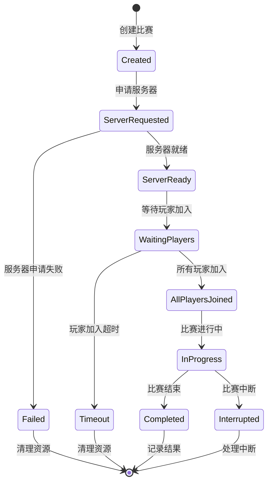

# Match 模型技术文档

## 概述

Match 模型是 Elo 匹配系统中比赛管理的核心实体，负责管理比赛的完整生命周期，从创建、服务器申请、玩家加入到比赛结束的全过程。该模型集成了阿里云ECS服务、RCON连接管理、玩家状态监控等复杂功能。

## 核心类结构

### Match 主类

```csharp
public class Match
{
    public string MatchID { get; set; } // 比赛ID
    public string[] Map { get; set; } // 比赛地图
    public string Mode { get; set; } // 比赛模式
    public List< MTG > ParticipatingTeams { get; set; } // 参与比赛的队伍列表
    public DateTime MatchCreateTime { get; set; } // 比赛创建时间
    public DateTime MatchStartTime { get; set; } // 比赛开始时间
    public DateTime MatchEndTime { get; set; } // 比赛结束时间
    public string? MatchResult { get; set; } // 比赛结果
    public Server Match_Server { get; set; } // 比赛服务器信息
}
```

### 核心属性说明

| 属性 | 类型 | 说明 |
|------|------|------|
| MatchID | string | 比赛唯一标识符 |
| Map | string[] | 比赛地图数组 |
| Mode | string | 比赛模式（竞技、休闲等） |
| ParticipatingTeams | List< MTG > | 参与比赛的队伍列表 |
| MatchCreateTime | DateTime | 比赛创建时间 |
| MatchStartTime | DateTime | 比赛开始时间 |
| MatchEndTime | DateTime | 比赛结束时间 |
| MatchResult | string? | 比赛结果 |
| Match_Server | Server | 比赛服务器信息 |

## 子模型详解

### Server - 服务器信息模型

```csharp
public class Server
{
    public string ServerID { get; set; } // 服务器ID
    public string ServerName { get; set; } // 服务器名称
    public string IP_Address { get; set; } // 服务器IP地址
    public string Port { get; set; } // 服务器Port
    public string ServerLocation { get; set; } // 服务器地理位置
    public string Status { get; set; }
    public string ISP { get; set; }
}
```

**属性说明**:

| 属性 | 类型 | 说明 |
|------|------|------|
| ServerID | string | 服务器实例ID |
| ServerName | string | 服务器名称 |
| IP_Address | string | 服务器公网IP地址 |
| Port | string | 服务器端口号 |
| ServerLocation | string | 服务器地理位置 |
| Status | string | 服务器运行状态 |
| ISP | string | 网络服务提供商 |

### MapSelection - 地图选择模型

```csharp
public class MapSelection
{
    public string MapName { get; set; }
    public List<Player > Players { get; set; }
}
```

## 核心方法

### MatchInitialization() - 比赛初始化

#### 双队伍初始化

```csharp
public void MatchInitialization(MTG TA, MTG TB)
{
    Random random = new Random();
    // 将 MatchID 设置为时间戳
    MatchID = DateTimeOffset.UtcNow.ToUnixTimeMilliseconds().ToString();
    Mode = TA.teams[0].TeamMode;
    MatchCreateTime = DateTime.UtcNow.AddHours(8); // 设置比赛创建时间为当前北京时间
    ParticipatingTeams = new List< MTG > { TA, TB }; // 将 TeamA 和 TeamB 加入到 ParticipatingTeams 中

    List<string> intersection = TA.Map.Intersect(TB.Map).ToList();
    if (intersection.Count > 0)
    {
        Map = new string[] { intersection[random.Next(0, intersection.Count)] };
    }
}
```

**初始化逻辑**:
1. 生成基于时间戳的比赛ID
2. 设置比赛模式为第一个队伍的模式
3. 设置创建时间为北京时间
4. 添加参与队伍
5. 选择两支队伍共同支持的地图

#### 多队伍初始化

```csharp
public void MatchInitialization(MTG TA, List< MTG > opponents)
{
    Random random = new Random();
    MatchID = DateTimeOffset.UtcNow.ToUnixTimeMilliseconds().ToString();
    Mode = TA.teams[0].TeamMode;
    MatchCreateTime = DateTime.UtcNow.AddHours(8);

    // 将所有参与的MTG添加到ParticipatingTeams中
    ParticipatingTeams = new List< MTG > { TA };
    ParticipatingTeams.AddRange(opponents);

    // 确定比赛地图
    List<string> allMaps = TA.Map.ToList();
    foreach (var opponent in opponents)
    {
        allMaps.AddRange(opponent.Map);
    }

    // 找到所有队伍都选择的地图
    List<string> commonMaps = allMaps
        .GroupBy(map => map)
        .Where(group => group.Count() == ParticipatingTeams.Count)
        .Select(group => group.Key)
        .ToList();

    if (commonMaps.Count > 0)
    {
        Map = new string[] { commonMaps[random.Next(0, commonMaps.Count)] };
    }
    else
    {
        Map = new string[] { TA.Map[random.Next(0, TA.Map.Length)] };
    }
}
```

**多队伍初始化逻辑**:
1. 合并所有参与队伍
2. 收集所有队伍的地图选择
3. 找到所有队伍都支持的地图
4. 如果没有共同地图，使用主队伍的地图

### AliYunClound_GenerateServer() - 阿里云服务器生成

```csharp
public async Task<bool> AliYunClound_GenerateServer()
{
    var server = AliYunCloundECS.ApplyMatchServer(this.MatchID);
    if (server == null)
    {
        Console.WriteLine("无法申请服务器。");
        return false;
    }

    this.Match_Server = server;
    DateTime Time = TimeZoneInfo.ConvertTime(DateTime.Now, TimeZoneInfo.FindSystemTimeZoneById("China Standard Time"));

    // 写入数据库中
    var createServerInfo = new match_server
    {
        Match_id = this.MatchID,
        ServerID = this.Match_Server.ServerID ?? string.Empty,
        ServerName = this.Match_Server.ServerName ?? string.Empty,
        IP_Address = this.Match_Server.IP_Address ?? string.Empty,
        Port = this.Match_Server.Port ?? string.Empty,
        ServerLocation = this.Match_Server.ServerLocation ?? string.Empty,
        Status = false,
        Created_at = Time.ToString()
    };

    match_server.InItializationServer(createServerInfo);

    if (server.Status == "Running")
    {
        Console.WriteLine("服务器状态: Running，开始尝试RCON连接");
        const int maxRetries = 120;
        const int retryDelayMs = 1000; // 1秒

        for (int retryCount = 0; retryCount < maxRetries; retryCount++)
        {
            Console.WriteLine($"RCON连接尝试 #{retryCount + 1}/{maxRetries}");
            try
            {
                Console.WriteLine($"尝试连接到比赛：{this.MatchID} ID 服务器： {server.IP_Address}:{server.Port}");
                var rcon = new RCON(IPAddress.Parse(server.IP_Address), (ushort)int.Parse(server.Port), "ace_server_manager_pass");
                Console.WriteLine("正在建立RCON连接...");
                await rcon.ConnectAsync();
                Console.WriteLine("RCON连接成功，正在检查是否完成赛前准备");

                string status = await rcon.SendCommandAsync("status");
                // 检查服务器是否可加入
                bool isJoinable = status.Contains("secure  public");
                if (!isJoinable)
                {
                    await Task.Delay(retryDelayMs);
                    continue;
                }

                string response = await rcon.SendCommandAsync($"matchzy_loadmatch_url \"https://online.playace.cn:11820/api/MatchData?MatchID={this.MatchID}\"");
                if (response.Contains("execing MatchZy/warmup.cfg"))
                {
                    // 等待3秒后检查加载状态
                    await Task.Delay(3000);
                    string loadStatusResponse = await rcon.SendCommandAsync("matchzy_check_load_status");
                    
                    if (loadStatusResponse.Contains("Match loaded successfully."))
                    {
                        return true;
                    }
                    else if (loadStatusResponse.Contains("Match load failed."))
                    {
                        // 再次确认一次
                        await Task.Delay(3000);
                        loadStatusResponse = await rcon.SendCommandAsync("matchzy_check_load_status");
                        if (loadStatusResponse.Contains("Match loaded successfully."))
                        {
                            return true;
                        }
                        Console.WriteLine("比赛加载失败，状态检查返回：" + loadStatusResponse);
                    }
                    else
                    {
                        Console.WriteLine("无法确认比赛加载状态，响应：" + loadStatusResponse);
                    }
                }
            }
            catch (Exception ex)
            {
                Console.WriteLine($"RCON 连接失败: {ex.Message}");
                await Task.Delay(retryDelayMs);
            }
        }

        Console.WriteLine($"RCON 连接失败，已达到最大重试次数 ({maxRetries})");

        // 失败回收服务器
        Region? region = AliYunCloundECS.Region.FirstOrDefault(R => R.RegionId == createServerInfo.ServerLocation);
        if (region != null)
        {
            var aliYunCloundclient = AliYunCloundECS.CreateClient(region.Endpoint);
            AliYunCloundECS.DeleteInstance(aliYunCloundclient, region.RegionId, this.Match_Server.ServerID);
            match_server.UpdataServerStatus(this.MatchID);
        }

        return false;
    }

    match_server.UpdataServerStatus(this.MatchID);
    return false;
}
```

**服务器生成流程**:
1. 申请阿里云ECS实例
2. 记录服务器信息到数据库
3. 等待服务器启动
4. 建立RCON连接
5. 加载比赛配置
6. 验证比赛加载状态
7. 失败时回收服务器资源

### GenerateServer() - 通用服务器生成

```csharp
public async Task<bool> GenerateServer()
{
    // 首先尝试使用可用服务器
    var availableServer = await ServerAuth.GetAvailableServer();
    if (availableServer != null)
    {
        return await InitializeMatchServerFromAvailableServer(availableServer);
    }

    // 如果没有可用服务器，申请新的阿里云服务器
    return await AliYunClound_GenerateServer();
}
```

**服务器生成策略**:
1. 优先使用现有可用服务器
2. 如果没有可用服务器，申请新的阿里云服务器
3. 确保服务器配置正确

### SuperviseMatchPlayerJoinStauts() - 监控玩家加入状态

```csharp
public async Task SuperviseMatchPlayerJoinStauts()
{
    const int maxWaitTime = 300; // 5分钟
    const int checkInterval = 10; // 10秒检查一次
    int elapsedTime = 0;

    while (elapsedTime < maxWaitTime)
    {
        try
        {
            // 获取当前加入服务器的玩家列表
            string currentPlayers = await GetJoinServerSteamIDList();
            
            // 获取应该加入的玩家列表
            var expectedPlayers = GetExpectedPlayerList();
            
            // 检查是否所有玩家都已加入
            bool allPlayersJoined = CheckAllPlayersJoined(currentPlayers, expectedPlayers);
            
            if (allPlayersJoined)
            {
                Console.WriteLine($"比赛 {MatchID} 所有玩家已加入，开始比赛");
                MatchStartTime = DateTime.UtcNow.AddHours(8);
                return;
            }
            
            // 检查是否有玩家超时未加入
            var timeoutPlayers = GetTimeoutPlayers(expectedPlayers, elapsedTime);
            if (timeoutPlayers.Any())
            {
                Console.WriteLine($"比赛 {MatchID} 有玩家超时未加入: {string.Join(", ", timeoutPlayers)}");
                await HandleTimeoutPlayers(timeoutPlayers);
                return;
            }
            
            await Task.Delay(checkInterval * 1000);
            elapsedTime += checkInterval;
        }
        catch (Exception ex)
        {
            Console.WriteLine($"监控玩家加入状态时发生错误: {ex.Message}");
            await Task.Delay(checkInterval * 1000);
            elapsedTime += checkInterval;
        }
    }
    
    Console.WriteLine($"比赛 {MatchID} 玩家加入超时");
    await HandleMatchTimeout();
}
```

**监控逻辑**:
1. 定期检查玩家加入状态
2. 比较当前玩家和预期玩家列表
3. 处理超时未加入的玩家
4. 设置比赛开始时间

### GetJoinServerSteamIDList() - 获取服务器玩家列表

```csharp
public async Task<string> GetJoinServerSteamIDList()
{
    try
    {
        if (Match_Server == null || string.IsNullOrEmpty(Match_Server.IP_Address) || string.IsNullOrEmpty(Match_Server.Port))
        {
            return "";
        }

        var rcon = new RCON(IPAddress.Parse(Match_Server.IP_Address), (ushort)int.Parse(Match_Server.Port), "ace_server_manager_pass");
        await rcon.ConnectAsync();
        
        string response = await rcon.SendCommandAsync("status");
        return ParsePlayerListFromStatus(response);
    }
    catch (Exception ex)
    {
        Console.WriteLine($"获取服务器玩家列表失败: {ex.Message}");
        return "";
    }
}
```

### SayServerRestartMessage() - 服务器重启消息

```csharp
public async Task<string> SayServerRestartMessage(int Time)
{
    try
    {
        if (Match_Server == null || string.IsNullOrEmpty(Match_Server.IP_Address) || string.IsNullOrEmpty(Match_Server.Port))
        {
            return "服务器信息不完整";
        }

        var rcon = new RCON(IPAddress.Parse(Match_Server.IP_Address), (ushort)int.Parse(Match_Server.Port), "ace_server_manager_pass");
        await rcon.ConnectAsync();
        
        string message = $"服务器将在 {Time} 秒后重启";
        string response = await rcon.SendCommandAsync($"say {message}");
        
        return response;
    }
    catch (Exception ex)
    {
        Console.WriteLine($"发送服务器重启消息失败: {ex.Message}");
        return $"发送消息失败: {ex.Message}";
    }
}
```

## 比赛生命周期管理

### 1. 比赛状态流转



### 2. 状态管理逻辑

```csharp
public class MatchStateManager
{
    public enum MatchState
    {
        Created,
        ServerRequested,
        ServerReady,
        WaitingPlayers,
        AllPlayersJoined,
        InProgress,
        Completed,
        Failed,
        Timeout,
        Interrupted
    }
    
    public static async Task<bool> TransitionToState(Match match, MatchState newState)
    {
        try
        {
            switch (newState)
            {
                case MatchState.ServerRequested:
                    return await match.GenerateServer();
                    
                case MatchState.WaitingPlayers:
                    await match.SuperviseMatchPlayerJoinStauts();
                    return true;
                    
                case MatchState.InProgress:
                    match.MatchStartTime = DateTime.UtcNow.AddHours(8);
                    return true;
                    
                case MatchState.Completed:
                    match.MatchEndTime = DateTime.UtcNow.AddHours(8);
                    await SaveMatchResult(match);
                    return true;
                    
                default:
                    return true;
            }
        }
        catch (Exception ex)
        {
            Console.WriteLine($"比赛状态转换失败: {ex.Message}");
            return false;
        }
    }
}
```

## 服务器管理

### 1. 服务器申请策略

```csharp
public class ServerAllocationStrategy
{
    public static async Task<Server> AllocateServer(string matchId, string mode)
    {
        // 策略1: 优先使用现有可用服务器
        var availableServer = await ServerAuth.GetAvailableServer();
        if (availableServer != null)
        {
            return availableServer;
        }
        
        // 策略2: 申请新的阿里云服务器
        var newServer = AliYunCloundECS.ApplyMatchServer(matchId);
        if (newServer != null)
        {
            return newServer;
        }
        
        // 策略3: 使用备用服务器池
        return await GetBackupServer();
    }
}
```

### 2. 服务器监控

```csharp
public class ServerMonitor
{
    public static async Task MonitorServerHealth(Server server)
    {
        while (true)
        {
            try
            {
                var rcon = new RCON(IPAddress.Parse(server.IP_Address), (ushort)int.Parse(server.Port), "ace_server_manager_pass");
                await rcon.ConnectAsync();
                
                string status = await rcon.SendCommandAsync("status");
                
                // 检查服务器状态
                if (!status.Contains("secure  public"))
                {
                    await HandleServerIssue(server);
                }
                
                await Task.Delay(30000); // 30秒检查一次
            }
            catch (Exception ex)
            {
                Console.WriteLine($"服务器监控异常: {ex.Message}");
                await HandleServerIssue(server);
                break;
            }
        }
    }
}
```

## 错误处理

### 1. 服务器申请失败处理

```csharp
public static async Task HandleServerAllocationFailure(Match match)
{
    Console.WriteLine($"比赛 {match.MatchID} 服务器申请失败");
    
    // 通知所有参与队伍
    foreach (var mtg in match.ParticipatingTeams)
    {
        foreach (var team in mtg.teams)
        {
            await NotifyTeam(team, "服务器申请失败，比赛取消");
        }
    }
    
    // 记录失败日志
    await LogMatchFailure(match, "服务器申请失败");
    
    // 清理资源
    await CleanupMatch(match);
}
```

### 2. 玩家加入超时处理

```csharp
public static async Task HandlePlayerJoinTimeout(Match match, List<string> timeoutPlayers)
{
    Console.WriteLine($"比赛 {match.MatchID} 玩家加入超时: {string.Join(", ", timeoutPlayers)}");
    
    // 标记超时玩家
    foreach (var playerId in timeoutPlayers)
    {
        await MarkPlayerTimeout(playerId);
    }
    
    // 通知其他玩家
    await NotifyRemainingPlayers(match, "有玩家超时未加入，比赛取消");
    
    // 记录超时日志
    await LogMatchTimeout(match, timeoutPlayers);
    
    // 清理资源
    await CleanupMatch(match);
}
```

## 性能优化

### 1. 连接池管理

```csharp
public class RCONConnectionPool
{
    private static readonly ConcurrentDictionary<string, RCON> _connectionPool = new();
    
    public static async Task<RCON> GetConnection(string serverIP, string serverPort)
    {
        var key = $"{serverIP}:{serverPort}";
        
        if (_connectionPool.TryGetValue(key, out var existingConnection))
        {
            try
            {
                // 测试连接是否有效
                await existingConnection.SendCommandAsync("status");
                return existingConnection;
            }
            catch
            {
                _connectionPool.TryRemove(key, out _);
            }
        }
        
        // 创建新连接
        var newConnection = new RCON(IPAddress.Parse(serverIP), (ushort)int.Parse(serverPort), "ace_server_manager_pass");
        await newConnection.ConnectAsync();
        _connectionPool.TryAdd(key, newConnection);
        
        return newConnection;
    }
}
```

### 2. 批量操作

```csharp
public static class MatchBatchOperations
{
    public static async Task BatchUpdateMatchStatus(List<Match> matches)
    {
        var tasks = matches.Select(match => UpdateMatchStatus(match));
        await Task.WhenAll(tasks);
    }
    
    public static async Task BatchMonitorMatches(List<Match> matches)
    {
        var monitoringTasks = matches.Select(match => match.SuperviseMatchPlayerJoinStauts());
        await Task.WhenAll(monitoringTasks);
    }
}
```

## 监控和维护

### 1. 比赛健康检查

```csharp
public static class MatchHealthCheck
{
    public static async Task<bool> CheckMatchHealth(Match match)
    {
        // 检查基本属性
        if (string.IsNullOrEmpty(match.MatchID))
            return false;
        
        if (match.ParticipatingTeams == null || match.ParticipatingTeams.Count == 0)
            return false;
        
        // 检查服务器状态
        if (match.Match_Server != null)
        {
            try
            {
                var rcon = await RCONConnectionPool.GetConnection(match.Match_Server.IP_Address, match.Match_Server.Port);
                string status = await rcon.SendCommandAsync("status");
                if (!status.Contains("secure  public"))
                    return false;
            }
            catch
            {
                return false;
            }
        }
        
        return true;
    }
}
```

### 2. 性能监控

```csharp
public static class MatchMetrics
{
    public static readonly Counter MatchCreations = Metrics.CreateCounter("match_creations_total", "Total match creations");
    public static readonly Counter ServerAllocations = Metrics.CreateCounter("server_allocations_total", "Total server allocations");
    public static readonly Gauge ActiveMatches = Metrics.CreateGauge("active_matches", "Number of active matches");
    public static readonly Histogram MatchDuration = Metrics.CreateHistogram("match_duration_seconds", "Match duration");
    public static readonly Histogram ServerAllocationTime = Metrics.CreateHistogram("server_allocation_time_seconds", "Server allocation time");
}
```

## 最佳实践

### 1. 创建比赛

```csharp
public static async Task<Match> CreateMatch(MTG teamA, MTG teamB)
{
    var match = new Match();
    match.MatchInitialization(teamA, teamB);
    
    // 申请服务器
    bool serverAllocated = await match.GenerateServer();
    if (!serverAllocated)
    {
        throw new Exception("服务器申请失败");
    }
    
    // 保存比赛信息
    await SaveMatchToDatabase(match);
    
    // 记录指标
    MatchMetrics.MatchCreations.Inc();
    
    return match;
}
```

### 2. 比赛状态同步

```csharp
public static async Task SyncMatchStatus(Match match)
{
    // 更新比赛状态
    await UpdateMatchInDatabase(match);
    
    // 通知所有参与队伍
    foreach (var mtg in match.ParticipatingTeams)
    {
        foreach (var team in mtg.teams)
        {
            await NotifyTeam(team, $"比赛 {match.MatchID} 状态更新");
        }
    }
    
    // 广播比赛信息
    await BroadcastMatchInfo(match);
}
```

### 3. 比赛清理

```csharp
public static async Task CleanupMatch(Match match)
{
    // 停止服务器监控
    await StopServerMonitoring(match);
    
    // 清理RCON连接
    await CleanupRCONConnections(match);
    
    // 释放服务器资源
    if (match.Match_Server != null)
    {
        await ReleaseServer(match.Match_Server);
    }
    
    // 从数据库中删除
    await DeleteMatchFromDatabase(match.MatchID);
    
    // 清理缓存
    MatchCache.RemoveMatch(match.MatchID);
}
```

## 总结

Match 模型通过完善的服务器管理、玩家监控、状态管理等功能，实现了比赛全生命周期的自动化管理。通过阿里云ECS集成、RCON连接管理、错误处理等机制，确保了比赛的稳定进行。

该模型不仅处理了复杂的服务器申请和配置流程，还实现了玩家状态的实时监控，为整个匹配系统提供了可靠的比赛执行环境。 