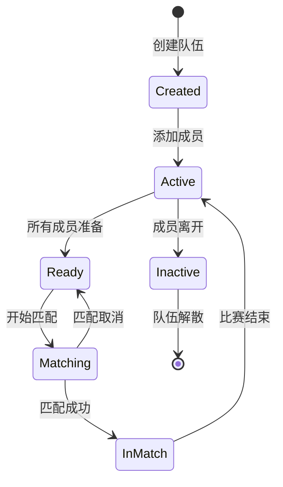

# Team 模型技术文档

## 概述

Team 模型是 Elo 匹配系统中队伍管理的核心实体，负责管理队伍的结构、状态、成员关系和匹配逻辑。该模型采用状态模式设计，通过不同的状态类管理队伍的匹配状态，实现了清晰的职责分离。

## 核心类结构

### Team 主类

```csharp
public class Team
{
    public string? TeamID { get; set; } // 队伍ID
    public Player Owner { get; set; } // 队伍的管理者
    public List< Player >? TeamMembers { get; set; } // 队伍成员列表
    public Team_MatchStatus Team_MatchStatus { get; set; } = new Team_MatchStatus();
    public int TeamSize { get; private set; } // 队伍人数
    public int TeamSkillLevel { get; set; } // 队伍技术水平
    public bool TeamOpenStatus { get; set; } = false; // 队伍是否公开
    public int TeamRank { get; set; } // 队伍排名
    public int TeamAveragePing { get; set; } // 队伍平均网络延迟
    public string? TeamMode { get; set; } // 队伍匹配模式
    public string[] Map { get; set; } = { "Dust II", "Inferno", "Mirage", "Nuke" , "Ancient" , "Anubis" , "Vertigo" , "Train" , "Overpass" ,  "Edin"  , "Italy" , "Office" }; // 队伍地图列表
    public Team_MatchInfo? T_MatchInfo { get; set; } = new Team_MatchInfo();
    public DateTime LastActivityTime { get; set; } // 队伍最后操作时间
    public bool MarkedForDeletion { get; set; } = false; // 默认值为 false , 队伍删除警告
}
```

### 核心属性说明

| 属性 | 类型 | 说明 | 默认值 |
|------|------|------|--------|
| TeamID | string? | 队伍唯一标识符 | null |
| Owner | Player | 队伍创建者和管理者 | - |
| TeamMembers | List< Player >? | 队伍成员列表 | null |
| Team_MatchStatus | Team_MatchStatus | 队伍匹配状态 | new() |
| TeamSize | int | 队伍总人数 | 0 |
| TeamSkillLevel | int | 队伍平均技能等级 | 0 |
| TeamOpenStatus | bool | 队伍是否公开可见 | false |
| TeamRank | int | 队伍排名 | 0 |
| TeamAveragePing | int | 队伍平均网络延迟 | 0 |
| TeamMode | string? | 队伍匹配模式 | null |
| Map | string[] | 队伍选择的地图列表 | 默认地图组 |
| T_MatchInfo | Team_MatchInfo? | 队伍比赛信息 | new() |
| LastActivityTime | DateTime | 最后活动时间 | - |
| MarkedForDeletion | bool | 是否标记为删除 | false |

## 子模型详解

### Team_MatchStatus - 队伍匹配状态

```csharp
public class Team_MatchStatus
{
    public bool TeamEnableMatch { get; set; } = false;
    public bool TeamMatching { get; set; } = false;
}
```

**属性说明**:

| 属性 | 类型 | 说明 | 默认值 |
|------|------|------|--------|
| TeamEnableMatch | bool | 队伍是否可以开始匹配 | false |
| TeamMatching | bool | 队伍是否正在匹配中 | false |

**状态组合**:

| TeamEnableMatch | TeamMatching | 状态描述 |
|----------------|--------------|----------|
| false | false | 队伍未准备，不能匹配 |
| true | false | 队伍已准备，等待匹配 |
| true | true | 队伍正在匹配中 |
| false | true | 异常状态（不应该出现） |

### Team_MatchInfo - 队伍比赛信息

```csharp
public class Team_MatchInfo
{
    public string MatchID { get; set; }
    public int TeamInMatchSerial { get; set; }
    public DateTime? Expect_Success_Time { get; set; }
    public DateTime? Join_Match_Time { get; set; }
}
```

**属性说明**:

| 属性 | 类型 | 说明 |
|------|------|------|
| MatchID | string | 比赛ID |
| TeamInMatchSerial | int | 队伍在比赛中的序号 |
| Expect_Success_Time | DateTime? | 预期匹配成功时间 |
| Join_Match_Time | DateTime? | 加入比赛时间 |

## 核心方法

### ValidateTeamState()

**功能**: 验证队伍状态的完整性和一致性

**实现**:
```csharp
public async Task<bool> ValidateTeamState()
{
    try
    {
        // 检查所有成员的连接状态
        if (!AreAllMembersTeamServiceActive())
        {
            return false;
        }

        // 检查队伍匹配状态
        if (Team_MatchStatus.TeamMatching)
        {
            // 验证匹配状态是否有效
            if (T_MatchInfo == null || string.IsNullOrEmpty(T_MatchInfo.MatchID))
            {
                return false;
            }
        }

        return true;
    }
    catch (Exception ex)
    {
        Console.WriteLine($"队伍 {TeamID} 状态验证失败: {ex.Message}");
        return false;
    }
}
```

**验证逻辑**:
1. 检查所有成员的队伍服务状态
2. 验证匹配状态的逻辑一致性
3. 确保比赛信息的完整性

### Update()

**功能**: 更新队伍的所有状态信息

**实现**:
```csharp
public void Update()
{
    UpdateTeamSize(); // 更新队伍人数
    UpdateTeamLevel();//更新队伍技术水平
    UpdataEnableStatus(); // 更新队伍是否达成开启匹配条件
    LastActivityTime = DateTime.UtcNow;
}
```

**更新内容**:
- 队伍人数统计
- 技能等级计算
- 匹配状态更新
- 活动时间记录

### UpdateTeamSize()

**功能**: 更新队伍人数统计

**实现**:
```csharp
public void UpdateTeamSize()
{
    TeamSize = 1; // Owner 本身算一个人
    if (TeamMembers != null)
    {
        TeamSize += TeamMembers.Count;
    }
}
```

**计算逻辑**:
- 队伍创建者（Owner）计为1人
- 队伍成员数量累加
- 总人数 = 1 + 成员数量

### UpdateTeamLevel()

**功能**: 更新队伍技能等级

**实现**:
```csharp
public void UpdateTeamLevel()
{
    // 更新队伍 TeamSkillLevel
    if (TeamMembers != null && TeamMembers.Count > 0)
    {
        double totalEloScore = Owner.PGInfo.EloScore; // 加入Owner的EloScore
        foreach (var player in TeamMembers)
        {
            totalEloScore += player.PGInfo.EloScore;
        }
        TeamSkillLevel = (int)Math.Round(totalEloScore / (TeamMembers.Count + 1));
    }
    else
    {
        // 如果没有其他成员，仅使用Owner的EloScore
        TeamSkillLevel = Owner.PGInfo.EloScore;
    }
}
```

**计算逻辑**:
- 计算所有成员（包括Owner）的Elo评分总和
- 除以总人数得到平均分
- 四舍五入到整数

### UpdataEnableStatus()

**功能**: 更新队伍是否满足匹配条件

**实现**:
```csharp
public void UpdataEnableStatus()
{
    int readyPlayerCount = 1;
    if (TeamMembers != null)
    {
        foreach (var player in TeamMembers)
        {
            if (player.ReadyStatus)
            {
                readyPlayerCount++;
            }
        }
    }

    if (readyPlayerCount == TeamSize)
    {
        Team_MatchStatus.TeamEnableMatch = true;
    }
    else
    {
        Team_MatchStatus.TeamEnableMatch = false;
        Team_MatchStatus.TeamMatching = false;
    }
}
```

**逻辑说明**:
- 统计准备就绪的玩家数量
- 如果所有玩家都准备就绪，允许匹配
- 否则禁止匹配并停止当前匹配

### AreAllMembersTeamServiceActive()

**功能**: 检查所有成员的队伍服务状态

**实现**:
```csharp
public bool AreAllMembersTeamServiceActive()
{
    // Check if owner's TeamServiceStatus is false
    if (!Owner.TeamServiceStatus)
    {
        return false;
    }

    // Check if any team member has TeamServiceStatus set to false
    if (TeamMembers != null)
    {
        foreach (var member in TeamMembers)
        {
            if (!member.TeamServiceStatus)
            {
                return false;
            }
        }
    }

    // If all checks pass, return true
    return true;
}
```

**检查逻辑**:
- 检查Owner的队伍服务状态
- 检查所有成员的队伍服务状态
- 只有所有成员都正常才返回true

### MergeTeams()

**功能**: 合并两个队伍

**实现**:
```csharp
public bool MergeTeams(Team MergeTeam)
{
    // 确保TeamMembers不为null
    if (TeamMembers == null)
    {
        TeamMembers = new List< Player >();
    }

    // 合并 Owner
    TeamMembers.Add(MergeTeam.Owner);

    // 合并 TeamMembers
    if (MergeTeam.TeamMembers != null)
    {
        TeamMembers.AddRange(MergeTeam.TeamMembers);
    }
    if (TeamMembers.Count > 4) return false; // 防止成员数量大于4
                                                     // 更新队伍信息
    UpdateTeamSize(); // 更新队伍人数
    UpdateTeamLevel();//更新队伍技术水平
    return true;
}
```

**合并逻辑**:
- 将目标队伍的Owner添加到当前队伍
- 合并所有队伍成员
- 检查成员数量限制（最大4人）
- 更新队伍统计信息

## 状态管理

### 1. 队伍生命周期状态



### 2. 状态转换逻辑

```csharp
public class TeamStateManager
{
    public static bool CanStartMatching(Team team)
    {
        return team.Team_MatchStatus.TeamEnableMatch && 
               !team.Team_MatchStatus.TeamMatching &&
               team.TeamSize >= 1 && team.TeamSize <= 4;
    }
    
    public static bool CanJoinMatch(Team team)
    {
        return team.Team_MatchStatus.TeamMatching &&
               team.T_MatchInfo?.MatchID != null;
    }
    
    public static void StartMatching(Team team)
    {
        if (CanStartMatching(team))
        {
            team.Team_MatchStatus.TeamMatching = true;
            team.Team_MatchStatus.TeamEnableMatch = false;
        }
    }
    
    public static void StopMatching(Team team)
    {
        team.Team_MatchStatus.TeamMatching = false;
        team.Team_MatchStatus.TeamEnableMatch = true;
        team.T_MatchInfo = null;
    }
}
```

## 成员管理

### 1. 添加成员

```csharp
public bool AddMember(Player player)
{
    // 检查成员数量限制
    if (TeamSize >= 4)
        return false;
    
    // 检查玩家是否已在队伍中
    if (Owner.UID == player.UID || 
        TeamMembers?.Any(m => m.UID == player.UID) == true)
        return false;
    
    // 检查玩家状态
    if (!player.TeamServiceStatus)
        return false;
    
    // 添加成员
    if (TeamMembers == null)
        TeamMembers = new List< Player >();
    
    TeamMembers.Add(player);
    Update();
    
    return true;
}
```

### 2. 移除成员

```csharp
public bool RemoveMember(string playerUID)
{
    if (TeamMembers == null)
        return false;
    
    var member = TeamMembers.FirstOrDefault(m => m.UID == playerUID);
    if (member == null)
        return false;
    
    TeamMembers.Remove(member);
    Update();
    
    return true;
}
```

### 3. 成员权限管理

```csharp
public class TeamPermissions
{
    public static bool CanKickMember(Player requester, Player target)
    {
        // 只有Owner可以踢人
        return requester.UID == target.TeamID;
    }
    
    public static bool CanInviteMember(Player requester)
    {
        // Owner和成员都可以邀请
        return requester.TeamServiceStatus;
    }
    
    public static bool CanChangeSettings(Player requester)
    {
        // 只有Owner可以修改设置
        return requester.UID == requester.TeamID;
    }
}
```

## 匹配逻辑

### 1. 匹配条件检查

```csharp
public class MatchConditions
{
    public static bool CheckMatchConditions(Team team)
    {
        // 检查队伍状态
        if (!team.Team_MatchStatus.TeamEnableMatch)
            return false;
        
        // 检查成员数量
        if (team.TeamSize < 1 || team.TeamSize > 4)
            return false;
        
        // 检查所有成员状态
        if (!team.AreAllMembersTeamServiceActive())
            return false;
        
        // 检查技能等级
        if (team.TeamSkillLevel < 0)
            return false;
        
        return true;
    }
}
```

### 2. 匹配优先级

```csharp
public class MatchPriority
{
    public static int CalculateMatchPriority(Team team)
    {
        int priority = 0;
        
        // 队伍人数权重
        priority += team.TeamSize * 10;
        
        // 等待时间权重
        var waitTime = DateTime.UtcNow - team.LastActivityTime;
        priority += (int)waitTime.TotalMinutes;
        
        // 技能等级权重
        priority += team.TeamSkillLevel / 100;
        
        return priority;
    }
}
```

## 性能优化

### 1. 缓存策略

```csharp
public class TeamCache
{
    private static readonly ConcurrentDictionary<string, Team> _teamCache = new();
    
    public static Team GetTeam(string teamId)
    {
        return _teamCache.GetOrAdd(teamId, id => LoadTeamFromDatabase(id));
    }
    
    public static void UpdateTeam(Team team)
    {
        _teamCache.AddOrUpdate(team.TeamID, team, (id, oldTeam) => team);
    }
    
    public static void RemoveTeam(string teamId)
    {
        _teamCache.TryRemove(teamId, out _);
    }
}
```

### 2. 批量操作

```csharp
public static class TeamBatchOperations
{
    public static async Task BatchUpdateTeamStatus(List<Team> teams)
    {
        var tasks = teams.Select(team => Task.Run(() => team.Update()));
        await Task.WhenAll(tasks);
    }
    
    public static async Task BatchValidateTeams(List<Team> teams)
    {
        var validationTasks = teams.Select(team => team.ValidateTeamState());
        var results = await Task.WhenAll(validationTasks);
        
        // 处理验证结果
        for (int i = 0; i < teams.Count; i++)
        {
            if (!results[i])
            {
                // 处理验证失败的队伍
                await HandleInvalidTeam(teams[i]);
            }
        }
    }
}
```

## 错误处理

### 1. 状态异常处理

```csharp
public static class TeamErrorHandler
{
    public static async Task HandleTeamStateError(Team team, Exception ex)
    {
        logger.LogError(ex, $"队伍 {team.TeamID} 状态错误");
        
        // 重置队伍状态
        team.Team_MatchStatus.TeamMatching = false;
        team.Team_MatchStatus.TeamEnableMatch = false;
        team.T_MatchInfo = null;
        
        // 通知所有成员
        await NotifyTeamMembers(team, "队伍状态异常，已重置");
        
        // 记录错误日志
        await LogTeamError(team, ex);
    }
}
```

### 2. 成员异常处理

```csharp
public static async Task HandleMemberDisconnection(Team team, Player member)
{
    // 更新成员状态
    member.TeamServiceStatus = false;
    
    // 检查是否需要解散队伍
    if (!team.AreAllMembersTeamServiceActive())
    {
        await DisbandTeam(team, "成员连接异常");
    }
    else
    {
        // 更新队伍状态
        team.Update();
        await NotifyTeamMembers(team, $"成员 {member.PInfo.Username} 连接异常");
    }
}
```

## 监控和维护

### 1. 队伍健康检查

```csharp
public static class TeamHealthCheck
{
    public static async Task<bool> CheckTeamHealth(Team team)
    {
        // 检查基本属性
        if (string.IsNullOrEmpty(team.TeamID))
            return false;
        
        if (team.Owner == null)
            return false;
        
        // 检查成员状态
        if (!team.AreAllMembersTeamServiceActive())
            return false;
        
        // 检查状态一致性
        if (team.Team_MatchStatus.TeamMatching && 
            (team.T_MatchInfo?.MatchID == null))
            return false;
        
        return true;
    }
}
```

### 2. 性能监控

```csharp
public static class TeamMetrics
{
    public static readonly Counter TeamCreations = Metrics.CreateCounter("team_creations_total", "Total team creations");
    public static readonly Counter TeamMerges = Metrics.CreateCounter("team_merges_total", "Total team merges");
    public static readonly Gauge ActiveTeams = Metrics.CreateGauge("active_teams", "Number of active teams");
    public static readonly Histogram TeamUpdateTime = Metrics.CreateHistogram("team_update_time_seconds", "Team update time");
}
```

## 最佳实践

### 1. 创建队伍

```csharp
public static async Task<Team> CreateTeam(Player owner, string teamMode = "competitive")
{
    var team = new Team
    {
        TeamID = GenerateTeamId(),
        Owner = owner,
        TeamMembers = new List< Player >(),
        TeamMode = teamMode,
        LastActivityTime = DateTime.UtcNow
    };
    
    // 初始化队伍状态
    team.Update();
    
    // 保存到数据库
    await SaveTeamToDatabase(team);
    
    // 记录指标
    TeamMetrics.TeamCreations.Inc();
    
    return team;
}
```

### 2. 队伍状态同步

```csharp
public static async Task SyncTeamStatus(Team team)
{
    // 更新队伍状态
    team.Update();
    
    // 同步到数据库
    await UpdateTeamInDatabase(team);
    
    // 通知所有成员
    await NotifyTeamMembers(team, "队伍状态已更新");
    
    // 广播队伍信息
    await BroadcastTeamInfo(team);
}
```

### 3. 队伍清理

```csharp
public static async Task CleanupTeam(Team team)
{
    // 停止匹配
    if (team.Team_MatchStatus.TeamMatching)
    {
        await StopTeamMatching(team);
    }
    
    // 通知所有成员
    await NotifyTeamMembers(team, "队伍已解散");
    
    // 清理缓存
    TeamCache.RemoveTeam(team.TeamID);
    
    // 从数据库中删除
    await DeleteTeamFromDatabase(team.TeamID);
}
```

## 总结

Team 模型通过状态模式实现了队伍管理的清晰分离，通过组合模式整合了各种子模型，实现了高内聚、低耦合的设计目标。

通过完善的状态管理、成员管理、匹配逻辑和错误处理机制，确保了队伍功能的稳定性和可靠性。同时，性能优化、监控维护和最佳实践为系统的长期运行提供了有力保障。 