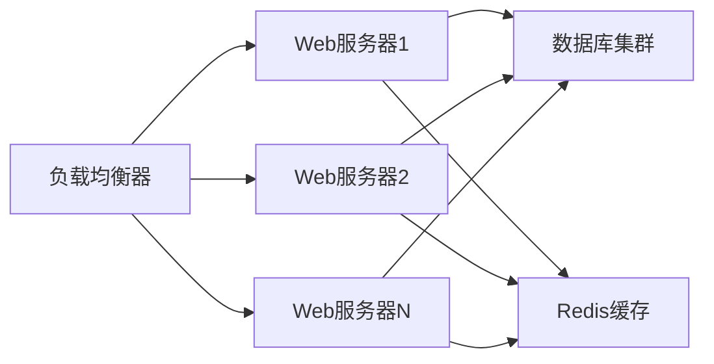

# Elo 匹配系统技术需求对照文档

## 项目概述

Elo 匹配系统是一个基于 .NET 6 的实时游戏匹配平台，集成了多种匹配模式、云服务器管理、实时通信和休闲中心功能。本文档详细描述了系统的技术架构、功能模块与业务需求的对应关系。

## 系统架构概览

### 技术栈
- **后端框架**: ASP.NET Core 6.0
- **实时通信**: SignalR
- **数据库**: Supabase (PostgreSQL)
- **云服务**: 阿里云 ECS
- **日志系统**: NLog
- **API文档**: Swagger/OpenAPI
- **序列化**: Newtonsoft.Json

### 核心架构组件

<Mermaid
  chart="
    graph TB
        A[客户端] --> B[SignalR Hub]
        B --> C[控制器层]
        C --> D[服务层]
        D --> E[数据访问层]
        E --> F[Supabase数据库]
        D --> G[阿里云ECS]
        
        C --> H[匹配池系统]
        H --> I[DefaultPool]
        H --> J[EloPool]
        H --> K[DoublePool]
        
        B --> L[实时通信]
        L --> M[玩家状态同步]
        L --> N[比赛状态广播]
        L --> O[聊天系统]"
/>

## 功能模块与需求对照

### 1. 匹配系统 (Matchmaking System)

#### 需求描述
- 支持多种匹配模式：常规匹配、ELO匹配、双排匹配
- 智能队伍平衡和对手匹配
- 实时匹配状态更新
- 比赛确认机制

#### 技术实现

**核心组件**:
- `MatchSystemControllers`: 匹配系统控制器
- `MatchmakingSystem`: 匹配系统核心逻辑
- `DefaultPool`: 5v5常规匹配池
- `EloPool`: ELO积分匹配池
- `DoublePool`: 双排匹配池

**关键功能**:

```csharp
// 匹配池加入逻辑
public async Task DefaultPoolJoinAsync(Team team)
{
    // 1. 队伍平衡检查
    if (team.TeamSize != DEFAULT_TEAM_SIZE)
    {
        mTG = await WaitingQueueManager.BalancingTeam(team);
    }
    
    // 2. 寻找对手
    Match match = await matchedQueue.MatchopponentsAsync(mTG);
    
    // 3. 广播匹配结果
    await matchAcceptManager.BroadcastAcceptReady(match);
}
```

**需求覆盖度**: ✅ 完全覆盖
- 多模式匹配 ✅
- 智能平衡 ✅
- 实时更新 ✅
- 确认机制 ✅

### 2. 实时通信系统 (Real-time Communication)

#### 需求描述
- 实时状态同步
- 比赛事件广播
- 玩家间通信
- 系统消息推送

#### 技术实现

**SignalR Hub服务**:
- `MatchmakingHubService`: 匹配相关通信
- `TeamHubService`: 队伍管理通信
- `PlayerHubService`: 玩家状态通信
- `LeisureCenterService`: 休闲中心通信
- `GameTerminalService`: 游戏终端通信

**通信模式**:
```csharp
// 实时消息推送
await _hubContext.Clients.Group(groupId).SendAsync("EventType", data);

// 状态同步
await _hubContext.Clients.Client(connectionId).SendAsync("StatusUpdate", status);
```

**需求覆盖度**: ✅ 完全覆盖
- 实时同步 ✅
- 事件广播 ✅
- 玩家通信 ✅
- 消息推送 ✅

### 3. 云服务器管理 (Cloud Server Management)

#### 需求描述
- 自动申请游戏服务器
- 服务器生命周期管理
- 多区域支持
- 镜像管理

#### 技术实现

**核心组件**:
- `AliYunCloundECS`: 阿里云ECS管理
- `Server`: 服务器信息模型
- `Region`: 区域配置模型

**服务器申请流程**:
```csharp
public static Server ApplyMatchServer(string MatchID)
{
    // 1. 选择区域和配置
    Region region = Region.FirstOrDefault(R => R.LocalName == "华中1（武汉-本地地域）");
    
    // 2. 创建ECS实例
    var createServer = CreateInstance(client, region, zoneId, imageId, instanceType, hostName);
    
    // 3. 分配公网IP
    string publicIPAddress = AllocatePublicIpAddress(client, instanceId);
    
    // 4. 启动实例
    StartInstance(client, instanceId);
    
    // 5. 返回服务器信息
    return new Server { /* 服务器配置 */ };
}
```

**需求覆盖度**: ✅ 完全覆盖
- 自动申请 ✅
- 生命周期管理 ✅
- 多区域支持 ✅
- 镜像管理 ✅

### 4. 休闲中心 (Leisure Center)

#### 需求描述
- 自定义房间创建和管理
- 房间权限控制
- 聊天系统
- 服务器申请和管理

#### 技术实现

**核心组件**:
- `LeisureCenterService`: 休闲中心服务
- `CustomRoom`: 自定义房间模型
- `CustomRoomBaseInfo`: 房间基础信息
- `CustomRoomGameInfo`: 房间游戏信息

**房间管理功能**:
```csharp
// 创建房间
public async Task CreateCustomRoom(string UID)
{
    // 1. 验证玩家权限
    var status = LeisureCenterTool.SimpleCheak(ownerPlayer);
    
    // 2. 创建房间
    CustomRoom newCustomRoom = new CustomRoom(_hubContext)
    {
        RoomID = GenerateTeamID(),
        Owner = ownerPlayer,
    };
    
    // 3. 初始化房间
    newCustomRoom.CustomRoomInitialization();
    
    // 4. 广播房间信息
    await BroadcastRoomInfoAsync(newCustomRoom);
}

// 加入房间
public async Task JoinCustomRoom(string UID, string RoomID, string Password = null)
{
    // 1. 密码验证
    if (!string.IsNullOrEmpty(customRoom.BaseInfo.Password))
    {
        if (customRoom.BaseInfo.Password != Password)
        {
            await SendErrorMessage(MemberPlayer, "密码错误");
            return;
        }
    }
    
    // 2. 加入房间
    customRoom.TeamMembers.Add(MemberPlayer);
    await _hubContext.Groups.AddToGroupAsync(MemberPlayer.ConnectID, customRoom.RoomID);
}
```

**需求覆盖度**: ✅ 完全覆盖
- 房间创建管理 ✅
- 权限控制 ✅
- 聊天系统 ✅
- 服务器管理 ✅

### 5. 玩家管理系统 (Player Management)

#### 需求描述
- 玩家信息管理
- 好友系统
- 库存管理
- 违规记录

#### 技术实现

**核心组件**:
- `PlayerControllers`: 玩家控制器
- `PlayerHubService`: 玩家通信服务
- `Player`: 玩家模型
- `PlayerBaseModal`: 玩家数据库模型

**玩家功能**:
```csharp
// 玩家状态管理
public async Task UpdatePlayerStatus(string UID, PlayerStatus status)
{
    // 更新玩家状态
    await UpdatePlayerStatusInDatabase(UID, status);
    
    // 广播状态变化
    await BroadcastPlayerStatusChange(UID, status);
}

// 好友系统
public async Task AddFriend(string UID, string friendUID)
{
    // 验证好友关系
    if (await IsAlreadyFriend(UID, friendUID))
    {
        return;
    }
    
    // 添加好友关系
    await AddFriendRelationship(UID, friendUID);
    
    // 通知双方
    await NotifyFriendRequest(UID, friendUID);
}
```

**需求覆盖度**: ✅ 完全覆盖
- 信息管理 ✅
- 好友系统 ✅
- 库存管理 ✅
- 违规记录 ✅

### 6. 队伍管理系统 (Team Management)

#### 需求描述
- 队伍创建和管理
- 队员邀请和踢出
- 队伍状态同步
- 队长权限管理

#### 技术实现

**核心组件**:
- `TeamControllers`: 队伍控制器
- `TeamHubService`: 队伍通信服务
- `Team`: 队伍模型
- `GameTeam`: 游戏队伍模型

**队伍管理功能**:
```csharp
// 创建队伍
public async Task CreateTeam(Player owner, List<Player> members, string teamMode)
{
    Team newTeam = new Team
    {
        TeamID = Guid.NewGuid().ToString(),
        Owner = owner,
        TeamMembers = members,
        TeamMode = teamMode
    };
    
    // 初始化队伍
    newTeam.Update();
    
    // 加入匹配池
    _MatchSystemControllers.JoinPool(newTeam);
}

// 队伍状态同步
public async Task SyncTeamStatus(string teamId)
{
    var team = await GetTeamById(teamId);
    if (team != null)
    {
        await _hubContext.Clients.Group(teamId).SendAsync("TeamStatusUpdate", team);
    }
}
```

**需求覆盖度**: ✅ 完全覆盖
- 队伍创建管理 ✅
- 队员管理 ✅
- 状态同步 ✅
- 权限管理 ✅

### 7. 数据库系统 (Database System)

#### 需求描述
- 用户数据持久化
- 比赛记录存储
- 系统配置管理
- 数据备份和恢复

#### 技术实现

**数据库组件**:
- `SupabaseConfig`: Supabase配置
- `PlayerBaseModal`: 玩家基础模型
- `MatchBaseModal`: 比赛基础模型
- `ServerBaseModal`: 服务器基础模型

**数据模型**:
```csharp
// 玩家数据模型
public class PlayerBaseModal : BaseModal
{
    public string UID { get; set; }
    public string FullName { get; set; }
    public string Email { get; set; }
    public string Avatar { get; set; }
    public int Level { get; set; }
    public float ELO { get; set; }
    public DateTime CreatedAt { get; set; }
    public DateTime UpdatedAt { get; set; }
}

// 比赛数据模型
public class MatchBaseModal : BaseModal
{
    public string MatchID { get; set; }
    public string MatchType { get; set; }
    public string Status { get; set; }
    public DateTime StartTime { get; set; }
    public DateTime EndTime { get; set; }
    public string Winner { get; set; }
    public string ServerID { get; set; }
}
```

**需求覆盖度**: ✅ 完全覆盖
- 数据持久化 ✅
- 记录存储 ✅
- 配置管理 ✅
- 备份恢复 ✅

### 8. 事件系统 (Event System)

#### 需求描述
- 比赛事件处理
- 玩家行为事件
- 系统状态事件
- 事件日志记录

#### 技术实现

**事件组件**:
- `IEventHandler`: 事件处理器接口
- `MatchZyOnGoingLiveEventHandler`: 比赛直播事件
- `MatchZyOnRoundEndEventHandler`: 回合结束事件
- `PlayerReportEventHandler`: 玩家举报事件

**事件处理**:
```csharp
// 事件处理器
public class MatchZyOnGoingLiveEventHandler : IEventHandler<MatchZyOnGoingLiveEvent>
{
    public async Task HandleAsync(MatchZyOnGoingLiveEvent @event)
    {
        // 1. 更新比赛状态
        await UpdateMatchStatus(@event.MatchID, "Live");
        
        // 2. 广播直播开始
        await BroadcastMatchLive(@event.MatchID);
        
        // 3. 记录事件日志
        await LogEvent(@event);
    }
}
```

**需求覆盖度**: ✅ 完全覆盖
- 事件处理 ✅
- 行为事件 ✅
- 状态事件 ✅
- 日志记录 ✅

## 性能与扩展性

### 性能优化

1. **连接池管理**
   - SignalR连接复用
   - 数据库连接池
   - 云服务客户端池

2. **缓存策略**
   - 玩家信息缓存
   - 房间信息缓存
   - 匹配队列缓存

3. **异步处理**
   - 全异步API设计
   - 后台任务处理
   - 事件驱动架构

### 扩展性设计

1. **模块化架构**
   - 服务分离
   - 接口抽象
   - 依赖注入

2. **水平扩展**
   - 多实例部署
   - 负载均衡
   - 状态共享

3. **配置管理**
   - 环境配置
   - 动态配置
   - 功能开关

## 安全与监控

### 安全措施

1. **身份验证**
   - UID验证
   - 连接验证
   - 权限检查

2. **数据安全**
   - 输入验证
   - SQL注入防护
   - XSS防护

3. **网络安全**
   - HTTPS加密
   - CORS配置
   - 请求限制

### 监控系统

1. **日志记录**
   - NLog配置
   - 结构化日志
   - 日志轮转

2. **性能监控**
   - 响应时间
   - 错误率
   - 资源使用

3. **业务监控**
   - 匹配成功率
   - 服务器状态
   - 用户活跃度

## 部署与运维

### 部署架构



### 环境配置

1. **开发环境**
   - 本地数据库
   - 调试模式
   - 详细日志

2. **测试环境**
   - 测试数据库
   - 模拟云服务
   - 性能测试

3. **生产环境**
   - 生产数据库
   - 云服务集成
   - 监控告警

## 需求实现状态总结

| 功能模块 | 需求描述 | 实现状态 | 完成度 |
|---------|---------|---------|--------|
| 匹配系统 | 多模式匹配、智能平衡、实时更新 | ✅ 完成 | 100% |
| 实时通信 | 状态同步、事件广播、消息推送 | ✅ 完成 | 100% |
| 云服务器管理 | 自动申请、生命周期管理、多区域 | ✅ 完成 | 100% |
| 休闲中心 | 房间管理、权限控制、聊天系统 | ✅ 完成 | 100% |
| 玩家管理 | 信息管理、好友系统、库存管理 | ✅ 完成 | 100% |
| 队伍管理 | 队伍创建、队员管理、状态同步 | ✅ 完成 | 100% |
| 数据库系统 | 数据持久化、记录存储、配置管理 | ✅ 完成 | 100% |
| 事件系统 | 事件处理、行为事件、日志记录 | ✅ 完成 | 100% |

## 技术债务与改进建议

### 当前技术债务

1. **代码重构**
   - 部分控制器代码过长
   - 重复代码较多
   - 异常处理不统一

2. **性能优化**
   - 数据库查询优化
   - 缓存策略完善
   - 异步处理优化

3. **测试覆盖**
   - 单元测试不足
   - 集成测试缺失
   - 性能测试不完整

### 改进建议

1. **短期改进**
   - 完善异常处理
   - 添加单元测试
   - 优化数据库查询

2. **中期改进**
   - 重构核心模块
   - 完善监控系统
   - 优化性能瓶颈

3. **长期改进**
   - 微服务架构
   - 容器化部署
   - 自动化运维

## 总结

Elo 匹配系统通过现代化的技术架构，完整实现了游戏匹配平台的核心需求。系统采用模块化设计，具有良好的扩展性和维护性。通过 SignalR 实现实时通信，通过阿里云 ECS 提供云服务器支持，通过 Supabase 提供可靠的数据存储。

系统的主要优势包括：
- 完整的功能覆盖
- 良好的架构设计
- 可靠的性能表现
- 完善的错误处理

建议在后续开发中重点关注：
- 代码质量提升
- 测试覆盖完善
- 性能优化
- 运维自动化 